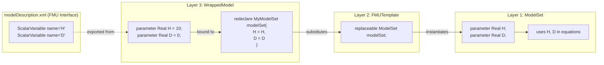
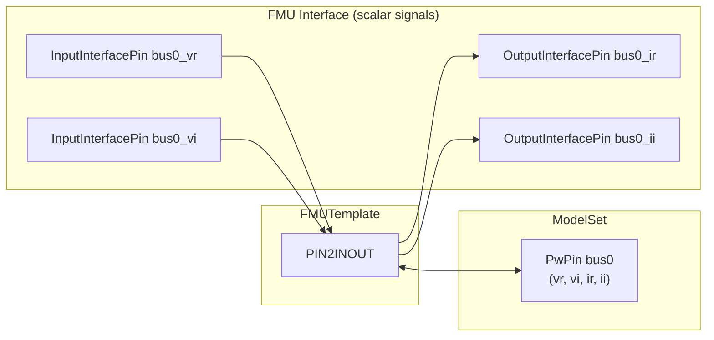
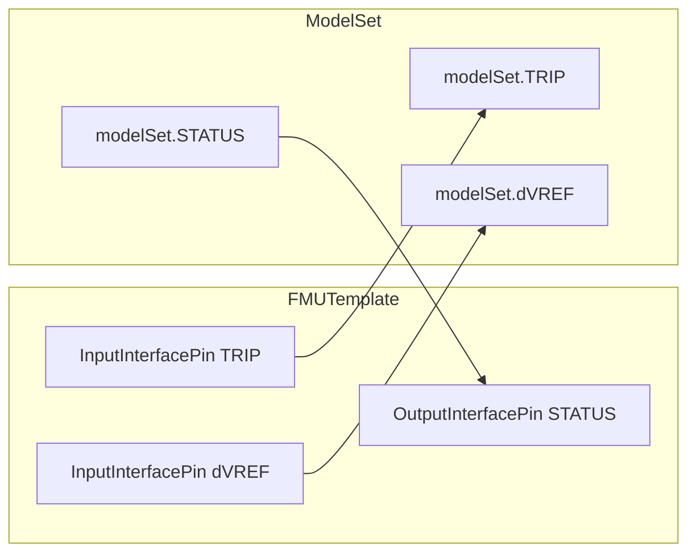

# Interface Specification for ePHASORSIM External Components

This document describes the patterns used to expose parameters, power pins, and regular I/O pins for custom components in the ePHASORSIM Modelica library.

> **See also:** For model types and quick-start guides, refer to the [Model Sets documentation](modelica/OpalRT/docs/ModelSets.md) and [QuickStart guide](modelica/OpalRT/docs/QuickStart.md).

## 1. Parameters

**Definition:** Parameters are constant values configurable by the user that influence model behavior.

### Three-Layer FMU Export Architecture

For FMU export, the library uses a three-layer architecture:

| Layer | Component | Location | Purpose |
|-------|-----------|----------|---------|
| **Layer 1** | ModelSet | `OpalRT.ModelSets.*` | Physics implementation |
| **Layer 2** | FMUTemplate | `OpalRT.ePHASORSIM.Wrappers.*` | I/O interface: flattens `PwPin` to scalar FMI signals |
| **Layer 3** | WrappedModel | `OpalRT.ePHASORSIM.WrappedModels.*` | FMU-exportable block with parameter re-declaration |

### Parameter Propagation for FMU Export



**Data flow:** User configures `H=5` via FMU → WrappedModel receives value → `redeclare` binds it to modelSet → ModelSet equations use `H=5`

**Why re-declaration?**

- **FMI Requirement**: Parameters must be declared at the top-level `block` to appear in `modelDescription.xml`
- **Naming Convention**: Re-declaration ensures concise names (e.g., `H` instead of `modelSet.H`)

### Formal Rules

| Rule | Description |
|------|-------------|
| **R1** | For FMU export, parameters **MUST** be re-declared at the `WrappedModel` level |
| **R2** | The `WrappedModel` **MUST** bind parameters to `modelSet` via `redeclare` |
| **R3** | Parameters prefixed with `modelSet.` are **NOT** exposed to ePHASORSIM |
| **R4** | Only `Real`, `Integer`, and `String` types are supported |

### Canonical Example (FMU Export)

```modelica
// Layer 1: ModelSet (OpalRT.ModelSets.TypeA.GENCLS)
model GENCLS
  parameter Real H = 10 "Inertia constant";
  parameter Real D = 0 "Damping coefficient";
  // ... physics implementation
end GENCLS;

// Layer 3: WrappedModel (OpalRT.ePHASORSIM.WrappedModels.GENCLS)
block GENCLS
  extends Wrappers.FMUTemplateInjectionTrip(
    redeclare ModelSets.TypeA.GENCLS modelSet(
      H = H,
      D = D));
  
  parameter Real H = 10 "Inertia constant";
  parameter Real D = 0 "Damping coefficient";
end GENCLS;
```

---

## 2. Power Pins

**Definition:** Power pins represent electrical bus connections in phasor domain (complex voltage/current).

### Naming Convention (MANDATORY)

For each bus connection indexed `N ∈ {0, 1, 2, ...}`:

| Signal | Direction | Type | Name Pattern |
|--------|-----------|------|--------------|
| Voltage (real) | input | `InputInterfacePin` | `busN_vr` |
| Voltage (imag) | input | `InputInterfacePin` | `busN_vi` |
| Current (real) | output | `OutputInterfacePin` | `busN_ir` |
| Current (imag) | output | `OutputInterfacePin` | `busN_ii` |

### Formal Rules

| Rule | Description |
|------|-------------|
| **P1** | Power pins **MUST** follow the naming pattern `bus<N>_<term>` where `N` is numeric and `<term> ∈ {vr, vi, ir, ii}` |
| **P2** | The `ModelSet` **MUST** declare a `PwPin` connector (e.g., `bus0`) |
| **P3** | The `FMUTemplate` **MUST** include a `PIN2INOUT` adapter to flatten `PwPin` to scalar I/O |
| **P4** | All four signals (`vr`, `vi`, `ir`, `ii`) **MUST** be present for each bus; incomplete definitions cause parse failure |
| **P5** | Indices **MUST** start at 0 and be contiguous |

### Architecture



### Canonical Example

```modelica
// Layer 1: ModelSet
partial model InjectionCore
  NonElectrical.Connector.PwPin bus0;
end InjectionCore;

// Layer 2: FMUTemplate
partial block FMUTemplateInjection
  extends FMUTemplateCommon;
  
  // Flattened I/O (visible to FMU interface)
  OpalRT.NonElectrical.Connector.InputInterfacePin bus0_vr;
  OpalRT.NonElectrical.Connector.InputInterfacePin bus0_vi;
  OpalRT.NonElectrical.Connector.OutputInterfacePin bus0_ir;
  OpalRT.NonElectrical.Connector.OutputInterfacePin bus0_ii;
  
  // Adapter
  OpalRT.NonElectrical.SignalRouting.PIN2INOUT bus0_PIN2INOUT;
  
  // ModelSet with PwPin
  replaceable OpalRT.ModelSets.InjectionCore modelSet;
  
equation
  connect(bus0_PIN2INOUT.vr, bus0_vr);
  connect(bus0_PIN2INOUT.vi, bus0_vi);
  connect(bus0_PIN2INOUT.ir, bus0_ir);
  connect(bus0_PIN2INOUT.ii, bus0_ii);
  connect(modelSet.bus0, bus0_PIN2INOUT.p);
end FMUTemplateInjection;

// Layer 3: WrappedModel (not shown - extends FMUTemplate and redeclares modelSet)
```

---

## 3. Regular Pins (Non-Power I/O)

**Definition:** Scalar real-valued signals for control inputs/outputs that are not power connections.

### Connector Types

| Type | Modelica Definition | FMI Causality |
|------|---------------------|---------------|
| `InputInterfacePin` | `connector InputInterfacePin = input Real` | `input` |
| `OutputInterfacePin` | `connector OutputInterfacePin = output Real` | `output` |

### Formal Rules

| Rule | Description |
|------|-------------|
| **I1** | Signal names **MUST NOT** match the pattern `bus<N>_*` (reserved for power pins) |
| **I2** | Inputs **MUST** use `InputInterfacePin`; outputs **MUST** use `OutputInterfacePin` |
| **I3** | Signals **MUST** be declared at both the `ModelSet` level and the `FMUTemplate` level |
| **I4** | The `FMUTemplate` **MUST** connect the top-level pin to `modelSet.<signal>` |
| **I5** | At the `ModelSet` level, the prefix `input` or `output` **SHOULD** be used for clarity |

### Propagation Pattern



### Canonical Example (Input)

```modelica
// Layer 1: ModelSet (base class)
partial model InjectionTrip
  extends InjectionCore;
  input NonElectrical.Connector.InputInterfacePin TRIP;
end InjectionTrip;

// Layer 2: FMUTemplate
partial block FMUTemplateInjectionTrip
  extends FMUTemplateCommon;
  
  OpalRT.NonElectrical.Connector.InputInterfacePin TRIP;
  replaceable OpalRT.ModelSets.InjectionTrip modelSet;
  // ... power pin declarations ...
  
equation
  connect(TRIP, modelSet.TRIP);
  // ... power pin connections ...
end FMUTemplateInjectionTrip;

// Layer 3: WrappedModel (not shown - extends FMUTemplate and redeclares modelSet)
```

### Canonical Example (Output)

```modelica
// Layer 1: ModelSet (base class)
partial model MyModelWithOutput
  extends InjectionCore;
  output NonElectrical.Connector.OutputInterfacePin SPEED;
end MyModelWithOutput;

// Layer 2: FMUTemplate
partial block FMUTemplateMyModel
  extends FMUTemplateCommon;
  
  OpalRT.NonElectrical.Connector.OutputInterfacePin SPEED;
  replaceable OpalRT.ModelSets.MyModelWithOutput modelSet;
  
equation
  connect(modelSet.SPEED, SPEED);
end FMUTemplateMyModel;

// Layer 3: WrappedModel (not shown - extends FMUTemplate and redeclares modelSet)
```

---

## 4. Version Metadata (Required)

All FMU templates **MUST** extend `FMUTemplateCommon` which provides:

```modelica
partial block FMUTemplateCommon
  final parameter Integer ephasorsim_minimum_major_version = 12;
  final parameter Integer ephasorsim_minimum_minor_version = 0;
end FMUTemplateCommon;
```

These parameters are required by ePHASORSIM for version compatibility checks.

---

## 5. Summary: Creating a New Component

To create a new ePHASORSIM-compatible FMU component:

1. **Choose the right ModelSet template** based on your component type (see [ModelSets documentation](modelica/OpalRT/docs/ModelSets.md))

2. **Create a ModelSet** in `OpalRT.ModelSets.*`:
   - Extend the chosen template (e.g., GenUnit type, Injection, or TwoPin base)
   - Redeclare components with your specific implementations
   - Declare any additional I/O pins

3. **Create or select an FMUTemplate** in `OpalRT.ePHASORSIM.Wrappers`:
   - Extend `FMUTemplateCommon`
   - Declare flattened power pins (`bus0_vr`, `bus0_vi`, `bus0_ir`, `bus0_ii`)
   - Include `PIN2INOUT` adapter(s)
   - Declare additional I/O pins at the top level

4. **Create a WrappedModel** in `OpalRT.ePHASORSIM.WrappedModels`:
   - Extend the appropriate `FMUTemplate`
   - Use `redeclare` to substitute your `ModelSet`
   - Re-declare all user-configurable parameters and bind them to `modelSet`

5. **Build the FMU** using `build.sh`
