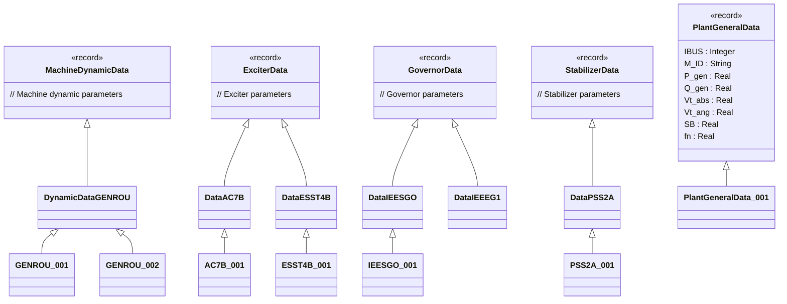

# OpalRT.GenUnits.Data — Data Records Structure

## **Overview**

The `OpalRT.GenUnits.Data` package provides all the **parameter records** used to configure generator models, exciters, governors, and stabilizers in the OpalRT Modelica library. These records are organized into sub-packages by component type and are designed for extensibility and reuse.

***

## **1. Main Data Record Categories**

### **General**

*   **PlantGeneralData**: General plant parameters (bus, machine ID, power, voltage, base, frequency, etc.)
    *   Specialized records: `PlantGeneralData_001`, `PlantGeneralData_002`, etc.

### **Machines**

*   **MachineDynamicData**: Base record for machine dynamic parameters.
    *   Specialized records for each machine type:
        *   `DynamicDataGENCLS`, `DynamicDataGENROE`, `DynamicDataGENROU`, `DynamicDataGENSAE`, `DynamicDataGENSAL`
        *   Concrete instances: `GENROU_001`, `GENROU_002`, etc.

### **Exciters**

*   **ExciterData**: Base record for exciter parameters.
    *   Specialized records for each exciter type (e.g., `DataAC7B`, `DataESST1A`, `DataEXAC1A`, etc.)
    *   Concrete instances: `AC7B_001`, `ESST1A_001`, etc.

### **Governors**

*   **GovernorData**: Base record for governor parameters.
    *   Specialized records for each governor type (e.g., `DataIEESGO`, `DataBBGOV1`, `DataDEGOV1`, etc.)
    *   Concrete instances: `IEESGO_001`, `BBGOV1_001`, etc.

### **Stabilizers**

*   **StabilizerData**: Base record for stabilizer parameters.
    *   Specialized records for each stabilizer type (e.g., `DataPSS2A`, `DataPSS2B`, `DataIEEEST`, etc.)
    *   Concrete instances: `PSS2A_001`, `IEEEST_001`, etc.

***

## **2. Class Diagram — High-Level Data Records Structure**



***

## **3. Key Points**

*   **Extensibility:** All data records are designed to be extended for specific machine, exciter, governor, or stabilizer types.
*   **Parameterization:** Each concrete model in the library uses these records to set its parameters, enabling easy configuration and scenario management.
*   **Organization:** The structure is hierarchical—base records define the interface, specialized records add type-specific parameters, and concrete records provide actual values.

***

## **4. Example: Data Record for a Synchronous Machine**

```modelica
record GENROU_001
  extends OpalRT.GenUnits.Data.Machines.GENROU.DynamicDataGENROU(
    ZSOURCE_RE = 0,
    Tdo_p = 7,
    Tdo_s = 0.03,
    Tqo_p = 0.7,
    Tqo_s = 0.04,
    H = 50,
    D = 0,
    Xd = 0.2,
    Xq = 0.19,
    Xd_p = 0.06,
    Xq_p = 0.06,
    Xd_s = 0.02,
    Xl = 0.03,
    S1 = 0.4,
    S12 = 0.8
  );
end GENROU_001;
```

***

## **5. Summary Table of Data Record Packages**

| Subpackage  | Base Record        | Example Specialized Record | Example Instance      |
| ----------- | ------------------ | -------------------------- | --------------------- |
| General     | PlantGeneralData   | PlantGeneralData\_001      | PlantGeneralData\_001 |
| Machines    | MachineDynamicData | DynamicDataGENROU          | GENROU\_001           |
| Exciters    | ExciterData        | DataAC7B                   | AC7B\_001             |
| Governors   | GovernorData       | DataIEESGO                 | IEESGO\_001           |
| Stabilizers | StabilizerData     | DataPSS2A                  | PSS2A\_001            |

***
