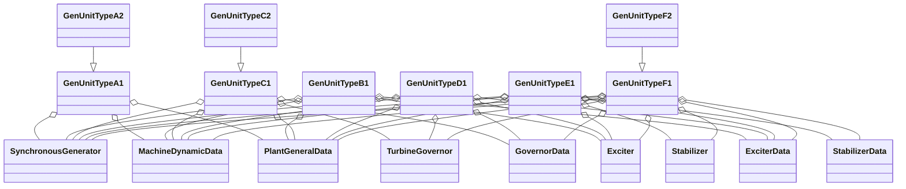

# OpalRT.GenUnits — Generating Unit Models Documentation (Types A–F)

## **Overview**

The `OpalRT.GenUnits` library provides a modular, extensible suite of Modelica models for simulating power system generating units. Models are organized by increasing complexity and control system integration, from basic synchronous machines to fully featured units with excitation, turbine-governor, and power system stabilizer (PSS) models. Each type is implemented as a partial model (template) that can be extended and specialized for a wide range of generator studies.

***

## **Model Type Comparison Table**

| Model Type | Synchronous Generator | Excitation System | Turbine-Governor | Power System Stabilizer | Data Records (Machine, Plant, Exciter, Governor, Stabilizer) |
| :--------: | :-------------------: | :---------------: | :--------------: | :---------------------: | :----------------------------------------------------------: |
| **Type A** |           ✔️          |         ❌         |         ❌        |            ❌            |                        Machine, Plant                        |
| **Type B** |           ✔️          |         ✔️        |         ❌        |            ❌            |                    Machine, Plant, Exciter                   |
| **Type C** |           ✔️          |         ❌         |        ✔️        |            ❌            |                   Machine, Plant, Governor                   |
| **Type D** |           ✔️          |         ✔️        |        ✔️        |            ❌            |               Machine, Plant, Exciter, Governor              |
| **Type E** |           ✔️          |         ✔️        |         ❌        |            ✔️           |              Machine, Plant, Exciter, Stabilizer             |
| **Type F** |           ✔️          |         ✔️        |        ✔️        |            ✔️           |         Machine, Plant, Exciter, Governor, Stabilizer        |

***

## **Type Summaries and Structure**

### **Type A: Synchronous Generator Only**

*   **Partial Models:** `GenUnitTypeA1`, `GenUnitTypeA2`
*   **Components:** Synchronous generator, machine data, plant data
*   **Use Case:** Basic generator modeling without excitation or governor systems. Ideal for fundamental studies, educational purposes, or when only the generator’s electromechanical dynamics are of interest.
*   **Extensibility:**
    *   `GenUnitTypeA1`: Base template with generator and data records.
    *   `GenUnitTypeA2`: Extends A1, adds internal connections (e.g., EFD–ETERM0, PMECH–PMECH0) for more detailed studies.

***

### **Type B: Generator + Excitation System**

*   **Partial Model:** `GenUnitTypeB1`
*   **Components:** Synchronous generator, exciter, machine data, plant data, exciter data
*   **Use Case:** Generator with voltage control via an excitation system. Suitable for voltage regulation studies and AVR tuning.
*   **Extensibility:**
    *   Replaceable exciter and data records allow easy swapping of excitation system models and parameter sets.

***

### **Type C: Generator + Turbine-Governor**

*   **Partial Models:** `GenUnitTypeC1`, `GenUnitTypeC2`
*   **Components:** Synchronous generator, turbine-governor, machine data, plant data, governor data
*   **Use Case:** Generator with speed/power control via a turbine-governor. Used for frequency response, load-following, and primary control studies.
*   **Extensibility:**
    *   `GenUnitTypeC1`: Standard governor interface.
    *   `GenUnitTypeC2`: Adds a `vTRIP` input for advanced trip logic or testing scenarios.

***

### **Type D: Generator + Excitation + Turbine-Governor**

*   **Partial Model:** `GenUnitTypeD1`
*   **Components:** Synchronous generator, exciter, turbine-governor, machine data, plant data, exciter data, governor data
*   **Use Case:** Generator with both voltage and speed/power control. Suitable for comprehensive dynamic studies, including coordinated AVR and governor response.
*   **Extensibility:**
    *   All major control blocks are replaceable, supporting a wide range of generator types and control strategies.

***

### **Type E: Generator + Excitation + Stabilizer**

*   **Partial Model:** `GenUnitTypeE1`
*   **Components:** Synchronous generator, exciter, stabilizer, machine data, plant data, exciter data, stabilizer data
*   **Use Case:** Generator with voltage control and system stability enhancement via a PSS. Used for small-signal stability and oscillation damping studies.
*   **Extensibility:**
    *   Replaceable stabilizer and data records enable rapid testing of different PSS designs and tunings.

***

### **Type F: Generator + Excitation + Turbine-Governor + Stabilizer**

*   **Partial Models:** `GenUnitTypeF1`, `GenUnitTypeF2`
*   **Components:** Synchronous generator, exciter, turbine-governor, stabilizer, machine data, plant data, exciter data, governor data, stabilizer data
*   **Use Case:** Full-featured generator model for advanced studies requiring all control loops—voltage, speed, and stability. Ideal for grid integration, disturbance response, and control interaction analysis.
*   **Extensibility:**
    *   `GenUnitTypeF1`: Standard interface for all four subsystems.
    *   `GenUnitTypeF2`: Adds a `vTRIP` input for enhanced trip logic or protection studies.

***

## **Component Table by Model Type**

| Component        | Type A | Type B | Type C | Type D | Type E | Type F |
| ---------------- | :----: | :----: | :----: | :----: | :----: | :----: |
| Synchronous Gen. |   ✔️   |   ✔️   |   ✔️   |   ✔️   |   ✔️   |   ✔️   |
| Exciter          |        |   ✔️   |        |   ✔️   |   ✔️   |   ✔️   |
| Turbine-Governor |        |        |   ✔️   |   ✔️   |        |   ✔️   |
| Stabilizer (PSS) |        |        |        |        |   ✔️   |   ✔️   |
| Machine Data     |   ✔️   |   ✔️   |   ✔️   |   ✔️   |   ✔️   |   ✔️   |
| Plant Data       |   ✔️   |   ✔️   |   ✔️   |   ✔️   |   ✔️   |   ✔️   |
| Exciter Data     |        |   ✔️   |        |   ✔️   |   ✔️   |   ✔️   |
| Governor Data    |        |        |   ✔️   |   ✔️   |        |   ✔️   |
| Stabilizer Data  |        |        |        |        |   ✔️   |   ✔️   |

***

## **High-Level Class Diagram**

***

## **Extending and Customizing Models**

*   **Replaceable Components:** All partial models use `replaceable` declarations for major subsystems (generator, exciter, governor, stabilizer), allowing users to substitute different implementations as needed.
*   **Data Records:** Parameterization is handled via replaceable data records, ensuring that all numerical values are externalized and easily swapped for scenario studies or OEM variants.
*   **Connector Conventions:** Each type provides standard connectors (e.g., `TRIP`, `dVREF`, `dGREF`, `bus0`, `vTRIP`) for integration into larger system models or test harnesses.
*   **Advanced Features:** Types C2 and F2 introduce additional trip logic inputs for advanced protection and testing scenarios.

***

## **Best Practices and Recommendations**

*   **Choose the simplest model type that meets your study objectives.** For basic electromechanical studies, Type A or B may suffice. For full dynamic and control interaction studies, use Type F.
*   **Leverage data records for parameter management.** This ensures reproducibility and simplifies scenario management.
*   **Extend partial models for custom generator types.** Use the provided templates as a base for new generator, exciter, governor, or stabilizer variants.
*   **Consult the class diagrams and tables above** to quickly identify which model type fits your needs and what components/data are required.

***

## **Summary**

*   **Type A:** Minimal, for basic generator modeling.
*   **Type B:** Adds excitation system for voltage control.
*   **Type C:** Adds turbine-governor for speed/power control.
*   **Type D:** Full generator, exciter, and governor for comprehensive control.
*   **Type E:** Generator with exciter and stabilizer for voltage and stability control.
*   **Type F:** Complete model with generator, exciter, governor, and stabilizer for advanced studies.

***

**This documentation is designed to help users select, extend, and apply the OpalRT.GenUnits library models efficiently and confidently. For further details, refer to the Modelica source code of each partial model.**

