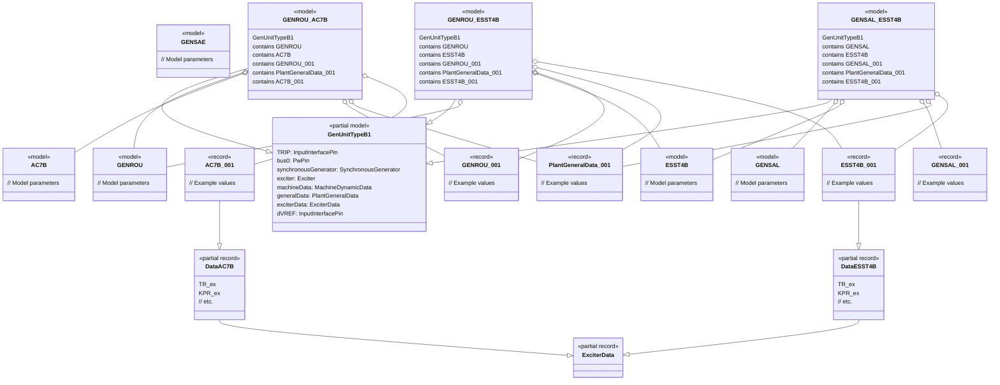
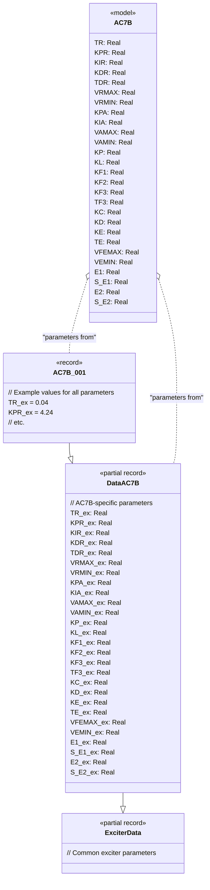
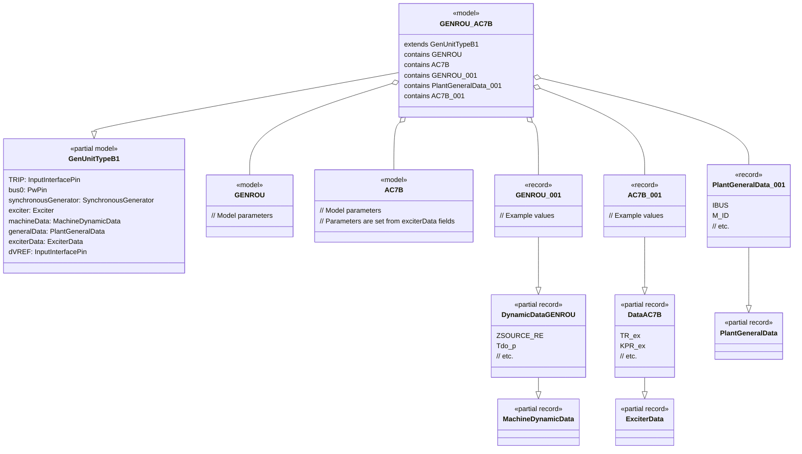
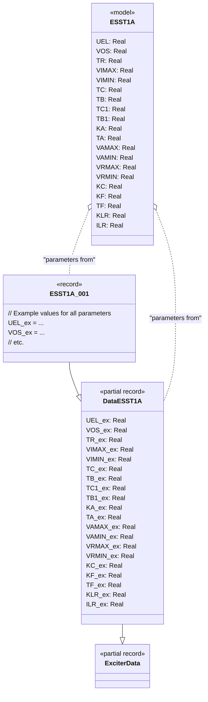
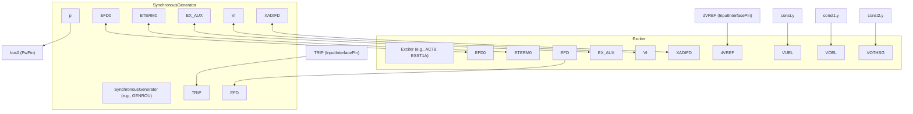

# OpalRT.GenUnits.TypeB — Documentation

## **TypeB Package Structure**

### **1. Partial Model: GenUnitTypeB1**

*   **GenUnitTypeB1** is the base partial model for generator units with both a synchronous machine and an excitation system.
*   It contains:
    *   **TRIP** (input pin)
    *   **bus0** (power pin)
    *   **synchronousGenerator** (replaceable, e.g., GENROU, GENSAE, GENSAL)
    *   **exciter** (replaceable, e.g., AC7B, ESST4B, EXAC3, etc.)
    *   **machineData** (replaceable, from Machines package)
    *   **generalData** (replaceable, from General package)
    *   **exciterData** (replaceable, from Exciters package)
    *   **dVREF** (input pin for excitation reference)
*   The partial model defines the connections between these components, including signal flow between generator and exciter.

***

### **2. Concrete Models**

*   Each concrete model (e.g., GENROU\_AC7B, GENROU\_ESST4B, GENSAE\_ESST1A, etc.) extends **GenUnitTypeB1**.
*   Each model:
    *   **redeclares** the synchronous generator (e.g., GENROU, GENSAE, GENSAL).
    *   **redeclares** the exciter (e.g., AC7B, ESST4B, EXAC3, etc.).
    *   **redeclares** the machine data record (e.g., GENROU\_001, GENROU\_002, GENSAL\_001, etc.).
    *   **redeclares** the general data record (e.g., PlantGeneralData\_001, PlantGeneralData\_002, etc.).
    *   **redeclares** the exciter data record (e.g., AC7B\_001, ESST4B\_001, etc.).

***

### **3. Data Records**

*   **MachineDynamicData**: Base record for machine parameters.
*   **DynamicDataGENROU**, **DynamicDataGENSAE**, **DynamicDataGENSAL**: Specialized records for each machine type.
*   **ExciterData**: Specialized records for each exciter type (e.g., AC7B\_001, ESST4B\_001).
*   **PlantGeneralData**: General plant parameters.

***

## **4. Mermaid Class Diagram**

Below is a Mermaid diagram showing the structure and relationships for TypeB models extending GenUnitTypeB1, including examples for GENROU and GENSAL machines with different exciters and data records.

In Modelica, **models** (like `Electrical.Control.Excitation.AC7B`) are components, while **records** (like `Data.Exciters.AC7B.AC7B_001`) are data containers. The exciter model takes its parameter values from the exciterData record, which itself inherits from a base record (e.g., `DataAC7B` → `ExciterData`). The parameter names in the exciter model and the record may differ (e.g., `TR` in the model, `TR_ex` in the record).

Here’s a detailed class diagram showing how exciters fit into a full generator model in the TypeB package, including the synchronous machine, general data, machine data, and exciter data.

**Explanation**

* **ExciterData** is the base record for all exciter data records.
* **DataAC7B** is a specialized record for AC7B exciter parameters, inheriting from ExciterData.
* **AC7B_001** is a concrete instance with actual parameter values, inheriting from DataAC7B.
* **AC7B** is the exciter model (component), declared as `Electrical.Control.Excitation.AC7B`.
* When the exciter is redeclared in a generator model, its parameters are assigned from the exciterData record, e.g., `TR=exciterData.TR_ex`.

For ESST1A, the structure is analogous:

***

## **Summary of Structure**

*   **GenUnitTypeB1** is the core partial model, providing the structure for generator units with excitation systems.
*   **Concrete models** (e.g., GENROU\_AC7B, GENROU\_ESST4B) extend GenUnitTypeB1 and redeclare the generator, exciter, and data records for specific configurations.
*   **Data records** allow for flexible parameterization, supporting multiple instances (e.g., GENROU\_001, GENROU\_002).
*   **Exciter models** are modular and can be swapped as needed.

***

## **Signal Connections in GenUnitTypeB1 (TypeB Generator Model)**

Based on the Modelica code for `GenUnitTypeB1`, the main signal connections between the exciter and synchronous machine are as follows:

*   **TRIP** (input pin) → `synchronousGenerator.TRIP`
*   **bus0** (power pin) ← `synchronousGenerator.p`
*   **dVREF** (input pin) → `exciter.dVREF`
*   **synchronousGenerator.EFD0** ↔ `exciter.EFD0`
*   **exciter.EFD** → `synchronousGenerator.EFD`
*   **synchronousGenerator.ETERM0** ↔ `exciter.ETERM0`
*   **synchronousGenerator.EX\_AUX** ↔ `exciter.EX_AUX`
*   **synchronousGenerator.VI** ↔ `exciter.VI`
*   **synchronousGenerator.XADIFD** ↔ `exciter.XADIFD`
*   **const.y** → `exciter.VUEL`
*   **const1.y** → `exciter.VOEL`
*   **const2.y** → `exciter.VOTHSG`

***

### **Signal Connections Diagram**

***

### **Explanation**

*   **Bidirectional arrows (`<-->`)** indicate signals that are connected both ways (feedback or shared signals).
*   **Unidirectional arrows (`-->`)** indicate signals that flow from one component to another.
*   **Constants** (`const.y`, etc.) are typically used for limiters or reference signals in the exciter.

***

### **Summary**

*   The exciter and synchronous generator exchange several signals, including field voltage, auxiliary signals, and measurement signals.
*   Input pins and constants provide reference and trip signals.
*   The structure is modular, allowing different exciter and generator types to be plugged in, with their parameters set from data records.

***

