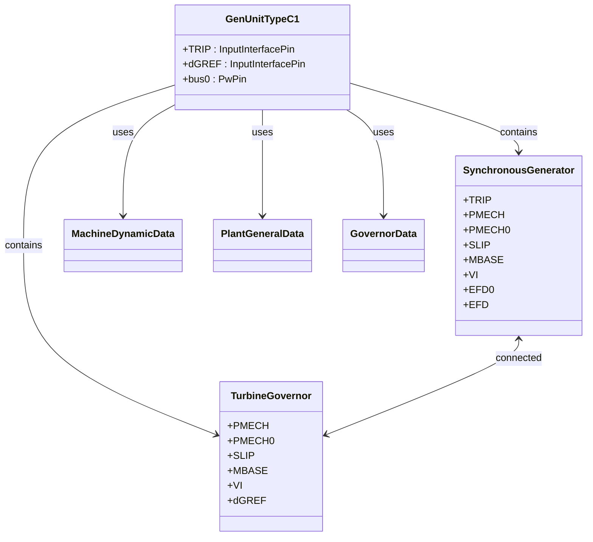
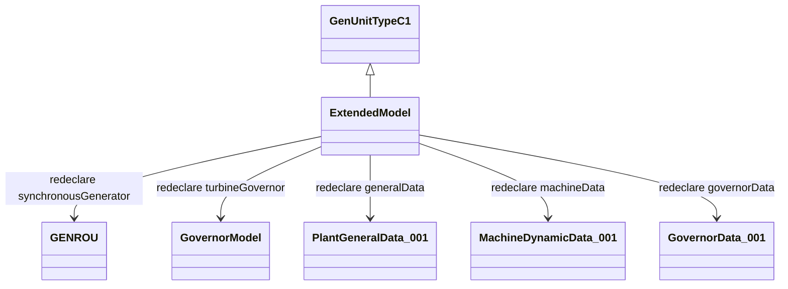
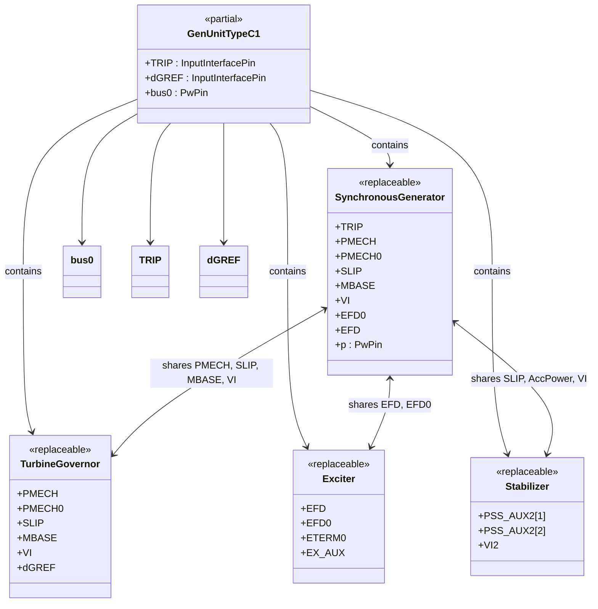
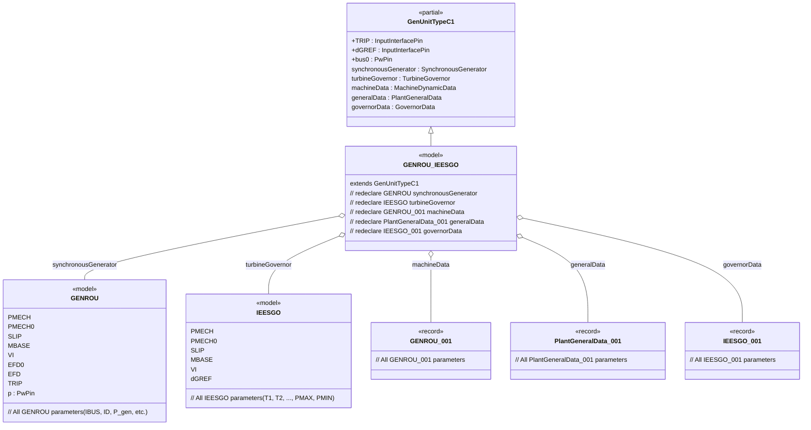

# OpalRT.GenUnits.TypeC — Documentation

## 🧩 High-Level Structure

### 📦 Package Overview

The **TypeC Package** defines a partial model `GenUnitTypeC1` that encapsulates a **Synchronous Generator** and a **Turbine-Governor** system. It is designed for modularity and extensibility using replaceable components and connectors.

### 🔧 Core Components

*   **Synchronous Generator**: `Electrical.PartialModel.SynchronousGenerator`
*   **Turbine Governor**: `Electrical.PartialModel.TurbineGovernor`
*   **Data Records**:
    *   `Data.Machines.MachineDynamicData`
    *   `Data.General.PlantGeneralData`
    *   `Data.Governors.GovernorData`

### 🔌 Connectors

*   `TRIP`: Input interface pin for trip signal
*   `dGREF`: Input interface pin for governor reference
*   `bus0`: Power pin for electrical connection

***

## 🧠 Some Features

### 🔁 Replaceable Architecture

Each major component is declared as **replaceable**, allowing for flexible instantiation and substitution in derived models.

### 🔗 Connection Logic

*   `TRIP` → `synchronousGenerator.TRIP`
*   `synchronousGenerator.p` → `bus0`
*   `turbineGovernor.PMECH` ↔ `synchronousGenerator.PMECH`
*   Additional shared parameters:
    *   `PMECH0`, `SLIP`, `MBASE`, `VI` are bidirectionally connected between generator and governor
*   `dGREF` → `turbineGovernor.dGREF`

***

## 🧭 Comparison with TypeA Package

Models in the **TypeA Package** include only the **Synchronous Generator**, without excitation or governor systems. TypeC models expand upon this by integrating the **Turbine-Governor** and associated data records, making it suitable for more dynamic simulations and control scenarios.

***

## 📐 High-Level Class Diagram

***

## 🔗 Component Extension Map (GenUnitTypeC1)

This diagram shows how models extending `GenUnitTypeC1` would typically redeclare components:

### 🧬 Mermaid Class Diagram: Connections in `GenUnitTypeC1`

## Model Implementation Example

