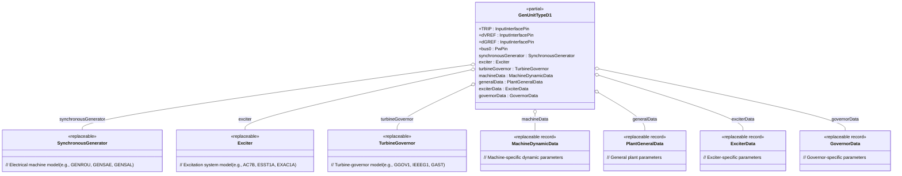
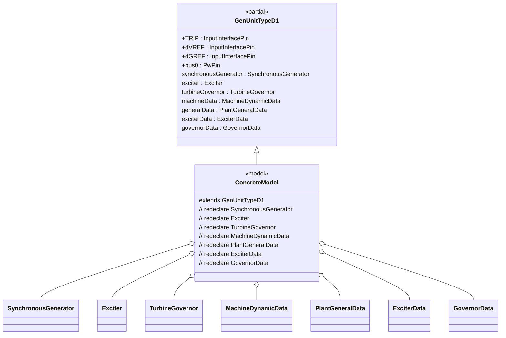
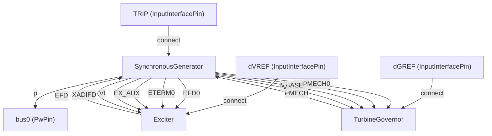
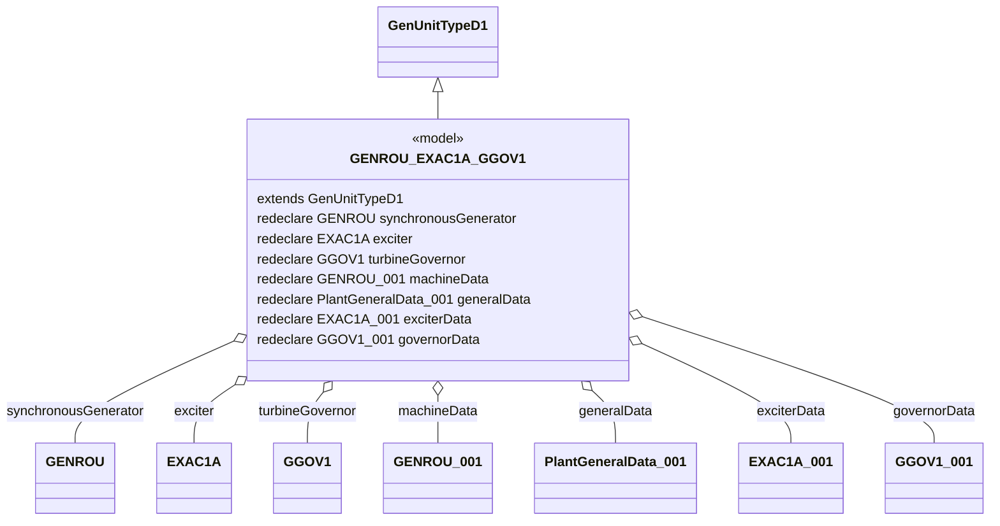

# OpalRT.GenUnits.TypeD — Documentation

## **1. High-Level Structure**

### **TypeD Package Overview**

The **TypeD** package defines generator unit models that combine a **Synchronous Machine**, an **Excitation System**, and a **Turbine-Governor**. This package is designed for advanced dynamic simulations where both voltage and speed control are required, and where modularity and extensibility are achieved through replaceable components and parameter records.

*   **Partial Model:** `GenUnitTypeD1`
    *   **Purpose:** Provides a template for generator units with both excitation and turbine-governor systems.
    *   **Key Features:** Modular, object-oriented, and highly configurable via replaceable components and data records.

*   **Concrete Models:** (e.g., `GENROU_EXAC1A_GGOV1`, `GENROU_ESST1A_BBGOV1`, etc.)
    *   **Purpose:** Implement models containing specific generator, exciter, and governor types by redeclaring the replaceable components and parameter records.

***

## **2. Object-Oriented Features**

### **Inheritance and Composition**

*   **Inheritance:** Concrete models extend the partial model `GenUnitTypeD1`.
*   **Composition:** Each unit contains:
    *   A **replaceable synchronous generator** (e.g., `GENROU`, `GENSAE`, `GENSAL`)
    *   A **replaceable exciter** (e.g., `EXAC1A`, `ESST1A`, `AC7B`)
    *   A **replaceable turbine-governor** (e.g., `GGOV1`, `IEEEG1`, `GAST`)
    *   **Replaceable data records** for machine, exciter, governor, and plant general data.

### **Replaceable Architecture**

*   All major components are declared as `replaceable`, allowing for flexible instantiation and substitution in derived models.
*   Parameter records are also replaceable, enabling easy configuration for different machine types and control strategies.

***

## **3. Class Diagrams**

### 📐 High-Level Class Diagram

### 🔗 Component Extension Map (GenUnitTypeD1)

***

### **3.2. Component Interconnections**

***

### **3.3. Example: Implementation of a Specific Model**

Let’s illustrate the structure for a concrete model, e.g., `GENROU_EXAC1A_GGOV1`:

***

## **4. Summary**

*   **GenUnitTypeD1** is the base partial model for generator units with both excitation and turbine-governor systems.
*   **Concrete models** (e.g., `GENROU_EXAC1A_GGOV1`) extend this partial model and redeclare the generator, exciter, governor, and data records for specific configurations.
*   **Data records** provide the parameters for each unit, supporting configuration and simulation.
*   **SynchronousGenerator** is the core electrical model, with connections to both the exciter and turbine-governor as needed.
*   **Exciter** and **TurbineGovernor** exchange signals with the generator for dynamic control.

***

## **6. Key Points**

*   **TypeD models** are highly modular and extensible, supporting a wide range of generator, exciter, and governor types.
*   **All parameters** are provided via replaceable data records, making the models easy to configure for different scenarios.
*   **Signal connections** are clearly defined, supporting advanced dynamic simulations.
