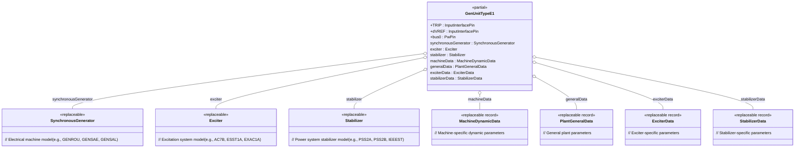
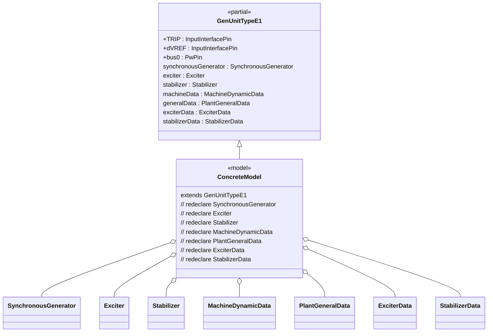
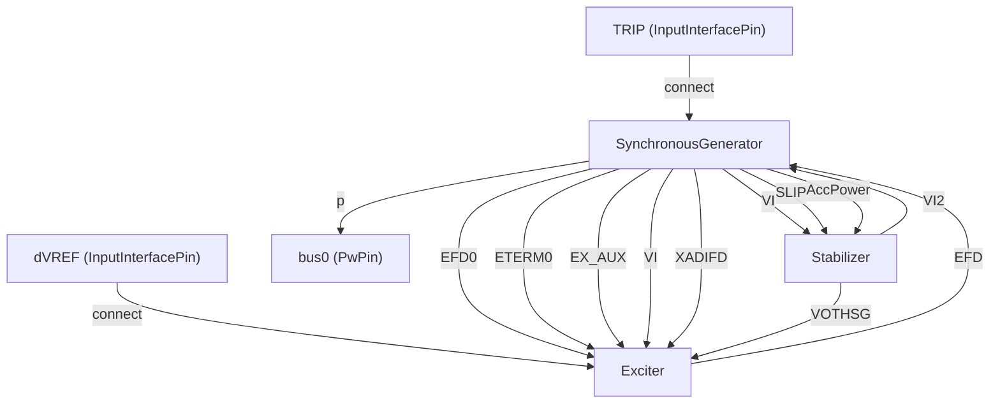
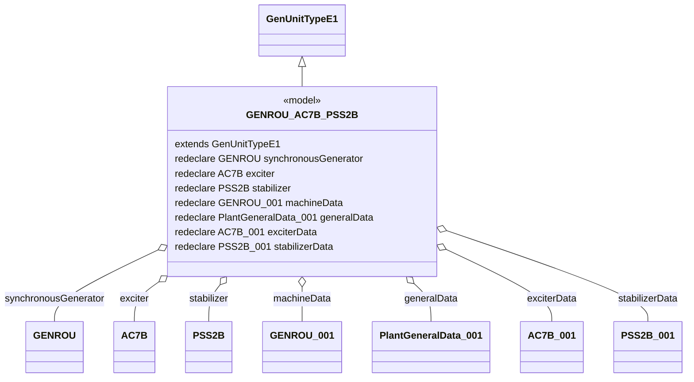

# OpalRT.GenUnits.TypeE — Documentation

## **1. High-Level Structure**

### **TypeE Package Overview**

The **TypeE** package defines generator unit models that combine a **Synchronous Machine**, an **Excitation System**, and a **Power System Stabilizer (PSS)**. This package is designed for advanced dynamic simulations where both voltage control and system stability enhancement are required, and where modularity and extensibility are achieved through replaceable components and parameter records.

*   **Partial Model:** `GenUnitTypeE1`
    *   **Purpose:** Provides a template for generator units with both excitation and stabilizer systems.
    *   **Key Features:** Modular, object-oriented, and highly configurable via replaceable components and data records.

*   **Concrete Models:** (e.g., `GENROU_AC7B_PSS2B`, `GENROU_ESST1A_PSS2A`, etc.)
    *   **Purpose:** Implement generation unit models containing specific generator, exciter, and stabilizer types by redeclaring the replaceable components and parameter records.

***

## **2. Object-Oriented Features**

### **Inheritance and Composition**

*   **Inheritance:** Concrete models extend the partial model `GenUnitTypeE1`.
*   **Composition:** Each unit contains:
    *   A **replaceable synchronous generator** (e.g., `GENROU`, `GENSAE`, `GENSAL`)
    *   A **replaceable exciter** (e.g., `EXAC1A`, `ESST1A`, `AC7B`)
    *   A **replaceable stabilizer** (e.g., `PSS2A`, `PSS2B`, `IEEEST`)
    *   **Replaceable data records** for machine, exciter, stabilizer, and plant general data.

### **Replaceable Architecture**

*   All major components are declared as `replaceable`, allowing for flexible instantiation and substitution in derived models.
*   Parameter records are also replaceable, enabling easy configuration for different machine types and control strategies.

***

## **3. Class Diagrams**

### 📐 High-Level Class Diagram

### 🔗 Component Extension Map (GenUnitTypeE1)

***

### **Component Interconnections**

***

### **Example: Implementation of a Specific Model**

Let’s illustrate the structure for a concrete model, e.g., `GENROU_AC7B_PSS2B`:

***

## **4. Summary**

*   **GenUnitTypeE1** is the base partial model for generator units with both excitation and stabilizer systems.
*   **Concrete models** (e.g., `GENROU_AC7B_PSS2B`) extend this partial model and redeclare the generator, exciter, stabilizer, and data records for specific configurations.
*   **Data records** provide the parameters for each unit, supporting configuration and simulation.
*   **SynchronousGenerator** is the core electrical model, with connections to both the exciter and stabilizer as needed.
*   **Exciter** and **Stabilizer** exchange signals with the generator for dynamic control and system stability.

***

## **6. Key Points**

*   **TypeE models** are highly modular and extensible, supporting a wide range of generator, exciter, and stabilizer types.
*   **All parameters** are provided via replaceable data records, making the models easy to configure for different scenarios.
*   **Signal connections** are clearly defined, supporting advanced dynamic simulations and system stability studies.
