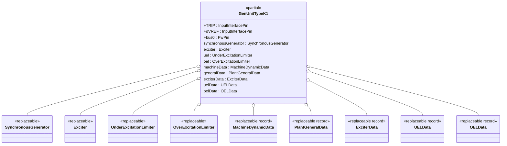
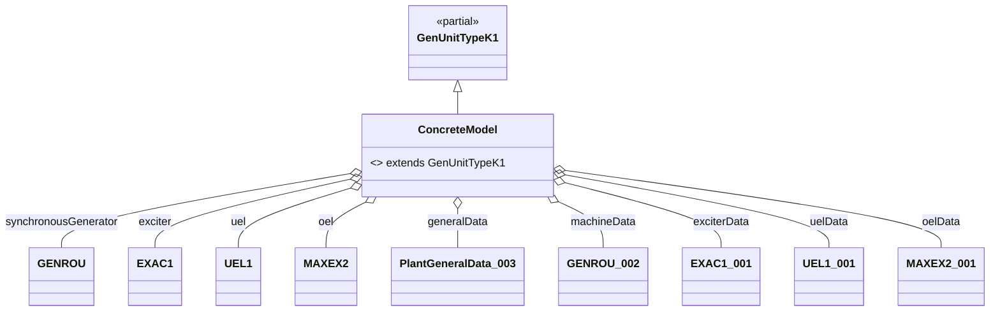

## OpalRT.GenUnits.TypeK — Documentation

### 1. High-Level Structure

#### TypeK Package Overview

The **TypeK** package defines generator unit models that combine a **Synchronous Machine**, an **Excitation System**, an **Under-Excitation Limiter (UEL)**, and an **Over-Excitation Limiter (OEL)**. These models are designed for dynamic studies where both UEL and OEL protections are relevant, but turbine-governor and stabilizer loops are not present. TypeK is ideal for scenarios requiring coordinated excitation system protection against both under- and over-excitation events.

*   **Partial Model:**
    *   `GenUnitTypeK1`: Standard interface for synchronous machine, exciter, UEL, and OEL.
*   **Purpose:**
    *   Provide a modular, extensible template for generator units with excitation, UEL, and OEL protection.
*   **Key Features:**
    *   Highly modular, object-oriented, and fully parameterized via replaceable components and data records.

***

### 2. Object-Oriented Features

#### Inheritance and Composition

*   **Inheritance:**
    *   Concrete models extend `GenUnitTypeK1`.
*   **Composition:**
    *   Each unit contains:
        *   A **replaceable synchronous generator**
        *   A **replaceable exciter**
        *   A **replaceable UEL**
        *   A **replaceable OEL**
        *   **Replaceable data records** for machine, exciter, UEL, OEL, and plant general data

#### Replaceable Architecture

*   All major components and parameter records are declared as `replaceable`, enabling flexible instantiation and substitution in derived models.
*   Parameterization is handled via data records.

***

### 3. Class Diagrams

#### High-Level Class Diagram



#### Component Extension Map (TypeK)



***

### 4. Signal Connections

TypeK models define all major signal connections between generator, exciter, UEL, and OEL, including:

*   **TRIP** → synchronousGenerator.TRIP
*   **dVREF** → exciter.dVREF
*   **bus0** ← synchronousGenerator.p
*   **synchronousGenerator ↔ exciter** (EFD, EFD0, ETERM0, EX\_AUX, VI, XADIFD)
*   **synchronousGenerator ↔ UEL** (VI, EX\_AUX)
*   **UEL → exciter** (VUEL, VF)
*   **synchronousGenerator ↔ OEL** (XADIFD)
*   **OEL → exciter** (VOEL, EFD)
*   **Default PMECH0 → PMECH** short (no governor present)
*   **VOEL/VOTHSG** are set to constants (no stabilizer present)

***

### 5. Example: Implementation of a TypeK Model

```modelica
model GENROU_EXAC1_UEL1_MAXEX2
  extends GenUnitTypeK1(
    redeclare Electrical.Machine.SynchronousMachine.GENROU synchronousGenerator(...),
    redeclare Electrical.Control.Excitation.EXAC1 exciter(...),
    redeclare Electrical.Control.UnderExcitationLimiter.UEL1 uel(...),
    redeclare Electrical.Control.OverExcitationLimiter.MAXEX2 oel(...),
    redeclare Data.General.PlantGeneralData_003 generalData,
    redeclare Data.Machines.GENROU.GENROU_002 machineData,
    redeclare Data.Exciters.EXAC1.EXAC1_001 exciterData,
    redeclare Data.UELs.UEL1.UEL1_001 uelData,
    redeclare Data.OELs.MAXEX2.MAXEX2_001 oelData
  );
end GENROU_EXAC1_UEL1_MAXEX2
```

*All parameters are sourced from the corresponding data records, ensuring full configurability and reproducibility.*

***

### 6. Key Points

*   **TypeK models** are modular generator unit templates supporting excitation, UEL, and OEL protection, but **do not include turbine-governor or stabilizer loops**.
*   **All parameters** are provided via replaceable data records, making the models easy to configure for different scenarios and studies.
*   **Signal connections** are clearly defined, supporting dynamic simulations and coordinated excitation protection.
*   **Extensibility:**
    *   Swap any subsystem (machine, exciter, UEL, OEL) by redeclaring the component and its data record.

***

### 7. Summary Table: TypeK Model Structure

| Component        | Description / Example (from GENROU\_EXAC1\_UEL1\_MAXEX2) |
| ---------------- | -------------------------------------------------------- |
| Synchronous Gen. | `GENROU` (redeclared)                                    |
| Exciter          | `EXAC1` (redeclared)                                     |
| UEL              | `UEL1` (redeclared)                                      |
| OEL              | `MAXEX2` (redeclared)                                    |
| Machine Data     | `GENROU_002`                                             |
| Plant Data       | `PlantGeneralData_003`                                   |
| Exciter Data     | `EXAC1_001`                                              |
| UEL Data         | `UEL1_001`                                               |
| OEL Data         | `MAXEX2_001`                                             |
