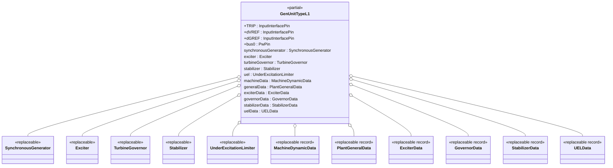
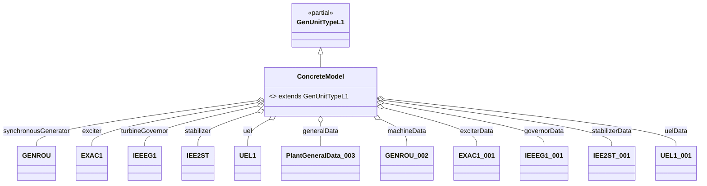

## OpalRT.GenUnits.TypeL — Documentation

### 1. High-Level Structure

#### TypeL Package Overview

The **TypeL** package defines generator unit models that combine a **Synchronous Machine**, an **Excitation System**, a **Turbine-Governor**, a **Power System Stabilizer (PSS)**, and an **Under-Excitation Limiter (UEL)**. These models are designed for advanced dynamic studies where all major generator control loops and UEL protection are relevant, such as grid integration, disturbance response, and control coordination.

*   **Partial Model:**
    *   `GenUnitTypeL1`: Standard interface for synchronous machine, exciter, turbine-governor, stabilizer, and UEL.
*   **Purpose:**
    *   Provide a flexible, extensible template for generator units with all major control systems and UEL protection.
*   **Key Features:**
    *   Highly modular, object-oriented, and fully parameterized via replaceable components and data records.

***

### 2. Object-Oriented Features

#### Inheritance and Composition

*   **Inheritance:**
    *   Concrete models extend `GenUnitTypeL1`.
*   **Composition:**
    *   Each unit contains:
        *   A **replaceable synchronous generator**
        *   A **replaceable exciter**
        *   A **replaceable turbine-governor**
        *   A **replaceable stabilizer**
        *   A **replaceable UEL**
        *   **Replaceable data records** for machine, exciter, governor, stabilizer, UEL, and plant general data

#### Replaceable Architecture

*   All major components and parameter records are declared as `replaceable`, enabling flexible instantiation and substitution in derived models.
*   Parameterization is handled via data records.

***

### 3. Class Diagrams

#### High-Level Class Diagram



#### Component Extension Map (TypeL)



***

### 4. Signal Connections

TypeL models define all major signal connections between generator, exciter, governor, stabilizer, and UEL, including:

*   **TRIP** → synchronousGenerator.TRIP
*   **dVREF** → exciter.dVREF
*   **dGREF** → turbineGovernor.dGREF
*   **bus0** ← synchronousGenerator.p
*   **synchronousGenerator ↔ exciter** (EFD, EFD0, ETERM0, EX\_AUX, VI, XADIFD)
*   **synchronousGenerator ↔ turbineGovernor** (PMECH, PMECH0, SLIP, MBASE, VI)
*   **synchronousGenerator ↔ stabilizer** (VI, SLIP, AccPower)
*   **stabilizer → exciter** (VOTHSG)
*   **synchronousGenerator ↔ UEL** (VI, EX\_AUX)
*   **UEL → exciter** (VUEL, VF)
*   **Default VOEL** is set to constant (no OEL present)

***

### 5. Example: Implementation of a TypeL Model

```modelica
model GENROU_EXAC1_IEEEG1_IEE2ST_UEL1
  extends GenUnitTypeL1(
    redeclare Electrical.Machine.SynchronousMachine.GENROU synchronousGenerator(...),
    redeclare Electrical.Control.Excitation.EXAC1 exciter(...),
    redeclare Electrical.Control.TurbineGovernor.IEEEG1 turbineGovernor(...),
    redeclare Electrical.Control.Stabilizer.IEE2ST stabilizer(...),
    redeclare Electrical.Control.UnderExcitationLimiter.UEL1 uel(...),
    redeclare Data.General.PlantGeneralData_003 generalData,
    redeclare Data.Machines.GENROU.GENROU_002 machineData,
    redeclare Data.Exciters.EXAC1.EXAC1_001 exciterData,
    redeclare Data.Governors.IEEEG1.IEEEG1_001 governorData,
    redeclare Data.Stabilizers.IEE2ST.IEE2ST_001 stabilizerData,
    redeclare Data.UELs.UEL1.UEL1_001 uelData
  );
end GENROU_EXAC1_IEEEG1_IEE2ST_UEL1
```

*All parameters are sourced from the corresponding data records, ensuring full configurability and reproducibility.*

***

### 6. Key Points

*   **TypeL models** are the most complete generator unit templates supporting excitation, governor, stabilizer, and UEL protection.
*   **All parameters** are provided via replaceable data records, making the models easy to configure for different scenarios and studies.
*   **Signal connections** are clearly defined, supporting advanced dynamic simulations, control interaction studies, and grid integration analysis.
*   **Extensibility:**
    *   Swap any subsystem (machine, exciter, governor, stabilizer, UEL) by redeclaring the component and its data record.

***

### 7. Summary Table: TypeL Model Structure

| Component        | Description / Example (from GENROU\_EXAC1\_IEEEG1\_IEE2ST\_UEL1) |
| ---------------- | ---------------------------------------------------------------- |
| Synchronous Gen. | `GENROU` (redeclared)                                            |
| Exciter          | `EXAC1` (redeclared)                                             |
| Turbine-Governor | `IEEEG1` (redeclared)                                            |
| Stabilizer (PSS) | `IEE2ST` (redeclared)                                            |
| UEL              | `UEL1` (redeclared)                                              |
| Machine Data     | `GENROU_002`                                                     |
| Plant Data       | `PlantGeneralData_003`                                           |
| Exciter Data     | `EXAC1_001`                                                      |
| Governor Data    | `IEEEG1_001`                                                     |
| Stabilizer Data  | `IEE2ST_001`                                                     |
| UEL Data         | `UEL1_001`                                                       |