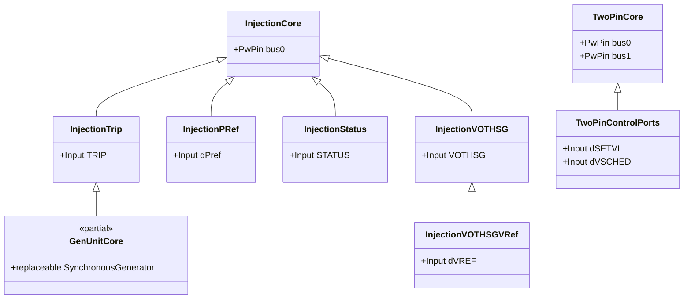
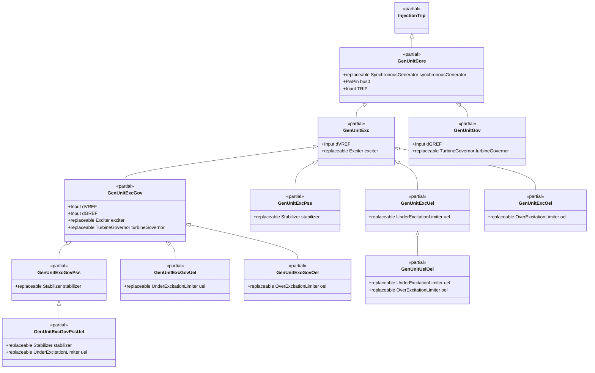
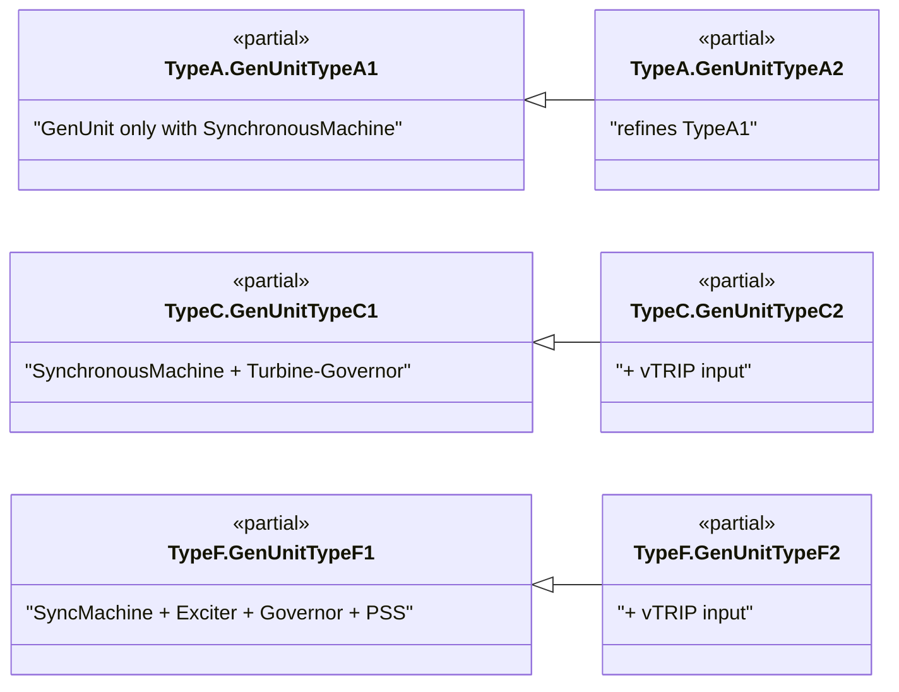

# OpalRT.ModelSets

## **Overview**

The `OpalRT.ModelSets` library provides a modular, extensible suite of Modelica models for simulating power system components within ePHASORSIM. The distinct characteristic of the models included in the `OpalRT.ModelSets` library is that they are interacting with ePHASORSIM through connectors such as `NonElectrical.Connector.PwPin` and `NonElectrical.Connector.InputInterfacePin`.

The library is organized into the following categories:

| Category | Description |
|----------|-------------|
| **GenUnit Types A–L** | Synchronous generator unit templates with varying control system combinations |
| **FACTS** | Flexible AC Transmission System devices (e.g., SVC, SVG) for reactive power and voltage control |
| **HVDC** | Line-commutated converter HVDC transmission models (e.g., CDC4T, CDC6TA) |
| **Induction Machine** | Three-phase squirrel-cage induction motor/generator models (e.g., CIMTR3, CIMTR4) |
| **PVGU1** | Utility-scale photovoltaic generation unit with irradiance, panel, and aggregator subsystems |
| **WT4G1** | Type 4 (full-converter) wind turbine generator model |
| **Other SM** | Additional synchronous machine models (e.g., SM_T1, GENROUSTATUS) |

### **Base Class Hierarchy**

All models are built on a layered hierarchy of partial base classes:

- **`InjectionCore`** — Single-bus injection base (one `PwPin` connector)
  - **`InjectionTrip`** — Adds `TRIP` input
  - **`InjectionPRef`** — Adds `dPref` power reference input
  - **`InjectionStatus`** — Adds `STATUS` input
  - **`InjectionVOTHSG`** — Adds `VOTHSG` stabilizer signal input
    - **`InjectionVOTHSGVRef`** — Adds `dVREF` voltage reference input
- **`TwoPinCore`** — Two-bus base (two `PwPin` connectors) for series-connected devices
  - **`TwoPinControlPorts`** — Adds `dSETVL` and `dVSCHED` control inputs (used by HVDC)
- **`GenUnitCore`** — Extends `InjectionTrip`, adds a replaceable synchronous generator

***

## **Generating Unit Models (Types A–L)**

Types A–L describe generator unit models (GenUnits) organized by increasing complexity and control system integration, from basic synchronous machines to fully featured units with excitation, turbine-governor, power system stabilizer (PSS), under-excitation limiter (UEL), and over-excitation limiter (OEL) models. Each type is implemented as a partial model (template) that can be extended and specialized for a wide range of generator studies.

***

## **GenUnit Type Summary**

*   **[Type A](TypeA.md):** Minimal, for basic generator modeling.
*   **[Type B](TypeB.md):** Adds excitation system for voltage control.
*   **[Type C](TypeC.md):** Adds turbine-governor for speed/power control.
*   **[Type D](TypeD.md):** Full generator, exciter, and governor for comprehensive control.
*   **[Type E](TypeE.md):** Generator with exciter and stabilizer for voltage and stability control.
*   **[Type F](TypeF.md):** Complete model with generator, exciter, governor, and stabilizer for advanced studies.
*   **[Type G](TypeG.md):** Generator with exciter and UEL for under-excitation protection studies.
*   **[Type H](TypeH.md):** Generator with exciter and OEL for over-excitation protection studies.
*   **[Type I](TypeI.md):** Generator with exciter, governor, and UEL for coordinated mechanical and UEL control.
*   **[Type J](TypeJ.md):** Generator with exciter, governor, and OEL for coordinated mechanical and OEL control.
*   **[Type K](TypeK.md):** Generator with exciter, UEL, and OEL for coordinated excitation protection.
*   **[Type L](TypeL.md):** Generator with exciter, governor, stabilizer, and UEL for advanced studies with UEL protection.

***

## **Generating Unit Model Type Comparison Table**

| Model Type | Synchronous Generator | Excitation System | Turbine-Governor | Power System Stabilizer | Under-Excitation Limiter | Over-Excitation Limiter |
| :--------: | :-------------------: | :---------------: | :--------------: | :---------------------: | :----------------------: | :---------------------: |
| **Type A** |           ✔️          |         ❌       |         ❌       |            ❌          |            ❌           |            ❌          |
| **Type B** |           ✔️          |         ✔️       |         ❌       |            ❌          |            ❌           |            ❌          |
| **Type C** |           ✔️          |         ❌       |         ✔️       |            ❌          |            ❌           |            ❌          |
| **Type D** |           ✔️          |         ✔️       |         ✔️       |            ❌          |            ❌           |            ❌          |
| **Type E** |           ✔️          |         ✔️       |         ❌       |            ✔️          |            ❌           |            ❌          |
| **Type F** |           ✔️          |         ✔️       |         ✔️       |            ✔️          |            ❌           |            ❌          |
| **Type G** |           ✔️          |         ✔️       |         ❌       |            ❌          |            ✔️           |            ❌          |
| **Type H** |           ✔️          |         ✔️       |         ❌       |            ❌          |            ❌           |            ✔️          |
| **Type I** |           ✔️          |         ✔️       |         ✔️       |            ❌          |            ✔️           |            ❌          |
| **Type J** |           ✔️          |         ✔️       |         ✔️       |            ❌          |            ❌           |            ✔️          |
| **Type K** |           ✔️          |         ✔️       |         ❌       |            ❌          |            ✔️           |            ✔️          |
| **Type L** |           ✔️          |         ✔️       |         ✔️       |            ✔️          |            ✔️           |            ❌          |

***

## **Type Summaries and Structure**

### **Type A: Synchronous Generator Only**

*   **Partial Models:** `GenUnitTypeA1`, `GenUnitTypeA2`
*   **Components:** Synchronous generator, machine data, plant data
*   **Use Case:** Basic generator modeling without excitation or governor systems. Ideal for fundamental studies, educational purposes, or when only the generator’s electromechanical dynamics are of interest.
*   **Extensibility:**
    *   `GenUnitTypeA1`: Base template with generator.
    *   `GenUnitTypeA2`: Extends A1, adds internal connections (e.g., EFD–ETERM0, PMECH–PMECH0) for more detailed studies.

***

### **Type B: Generator + Excitation System**

*   **Partial Model:** `GenUnitTypeB1`
*   **Components:** Synchronous generator, exciter, machine data, plant data, exciter data
*   **Use Case:** Generator with voltage control via an excitation system. Suitable for voltage regulation studies and AVR tuning.
*   **Extensibility:**
    *   Replaceable exciter allows easy swapping of excitation system models and parameter sets.

***

### **Type C: Generator + Turbine-Governor**

*   **Partial Models:** `GenUnitTypeC1`, `GenUnitTypeC2`
*   **Components:** Synchronous generator, turbine-governor, machine data, plant data, governor data
*   **Use Case:** Generator with speed/power control via a turbine-governor. Used for frequency response, load-following, and primary control studies.
*   **Extensibility:**
    *   `GenUnitTypeC1`: Standard governor interface.
    *   `GenUnitTypeC2`: Adds a `vTRIP` input for advanced trip logic or testing scenarios.

***

### **Type D: Generator + Excitation + Turbine-Governor**

*   **Partial Model:** `GenUnitTypeD1`
*   **Components:** Synchronous generator, exciter, turbine-governor, machine data, plant data, exciter data, governor data
*   **Use Case:** Generator with both voltage and speed/power control. Suitable for comprehensive dynamic studies, including coordinated AVR and governor response.
*   **Extensibility:**
    *   All major control blocks are replaceable, supporting a wide range of generator types and control strategies.

***

### **Type E: Generator + Excitation + Stabilizer**

*   **Partial Model:** `GenUnitTypeE1`
*   **Components:** Synchronous generator, exciter, stabilizer, machine data, plant data, exciter data, stabilizer data
*   **Use Case:** Generator with voltage control and system stability enhancement via a PSS. Used for small-signal stability and oscillation damping studies.
*   **Extensibility:**
    *   Replaceable stabilizer enables rapid testing of different PSS designs and tunings.

***

### **Type F: Generator + Excitation + Turbine-Governor + Stabilizer**

*   **Partial Models:** `GenUnitTypeF1`, `GenUnitTypeF2`
*   **Components:** Synchronous generator, exciter, turbine-governor, stabilizer, machine data, plant data, exciter data, governor data, stabilizer data
*   **Use Case:** Full-featured generator model for advanced studies requiring all control loops—voltage, speed, and stability. Ideal for grid integration, disturbance response, and control interaction analysis.
*   **Extensibility:**
    *   `GenUnitTypeF1`: Standard interface for all four subsystems.
    *   `GenUnitTypeF2`: Adds a `vTRIP` input for enhanced trip logic or protection studies.

***

### **Type G: Generator + Excitation + UEL**

*   **Partial Model:** `GenUnitTypeG1`
*   **Components:** Synchronous generator, exciter, under-excitation limiter, machine data, plant data, exciter data, UEL data
*   **Use Case:** Generator with voltage control and UEL protection. Suitable for excitation system validation, UEL coordination, and studies where governor control is handled externally.
*   **Extensibility:**
    *   Replaceable exciter and UEL allow easy swapping of models and parameter sets.

***

### **Type H: Generator + Excitation + OEL**

*   **Partial Model:** `GenUnitTypeH1`
*   **Components:** Synchronous generator, exciter, over-excitation limiter, machine data, plant data, exciter data, OEL data
*   **Use Case:** Generator with voltage control and OEL protection. Suitable for OEL validation, excitation system studies, and scenarios where mechanical and UEL control are handled externally.
*   **Extensibility:**
    *   Replaceable exciter and OEL allow easy swapping of models and parameter sets.

***

### **Type I: Generator + Excitation + Turbine-Governor + UEL**

*   **Partial Model:** `GenUnitTypeI1`
*   **Components:** Synchronous generator, exciter, turbine-governor, under-excitation limiter, machine data, plant data, exciter data, governor data, UEL data
*   **Use Case:** Generator with voltage control, speed/power control, and UEL protection. Used for coordinated governor and UEL studies.
*   **Extensibility:**
    *   All major control blocks are replaceable, supporting a wide range of generator types and control strategies.

***

### **Type J: Generator + Excitation + Turbine-Governor + OEL**

*   **Partial Model:** `GenUnitTypeJ1`
*   **Components:** Synchronous generator, exciter, turbine-governor, over-excitation limiter, machine data, plant data, exciter data, governor data, OEL data
*   **Use Case:** Generator with voltage control, speed/power control, and OEL protection. Used for coordinated governor and OEL studies.
*   **Extensibility:**
    *   All major control blocks are replaceable, supporting a wide range of generator types and control strategies.

***

### **Type K: Generator + Excitation + UEL + OEL**

*   **Partial Model:** `GenUnitTypeK1`
*   **Components:** Synchronous generator, exciter, under-excitation limiter, over-excitation limiter, machine data, plant data, exciter data, UEL data, OEL data
*   **Use Case:** Generator with voltage control and coordinated UEL/OEL protection. Suitable for studies requiring both under- and over-excitation protection without governor or stabilizer loops.
*   **Extensibility:**
    *   Replaceable exciter, UEL, and OEL enable flexible configuration.

***

### **Type L: Generator + Excitation + Turbine-Governor + Stabilizer + UEL**

*   **Partial Model:** `GenUnitTypeL1`
*   **Components:** Synchronous generator, exciter, turbine-governor, stabilizer, under-excitation limiter, machine data, plant data, exciter data, governor data, stabilizer data, UEL data
*   **Use Case:** Advanced generator model with all major control loops plus UEL protection. Ideal for grid integration, disturbance response, and control coordination with UEL.
*   **Extensibility:**
    *   All major control blocks are replaceable, supporting a wide range of generator types and control strategies.

***

## **Component Table by Model Type**

| Component        | Type A | Type B | Type C | Type D | Type E | Type F | Type G | Type H | Type I | Type J | Type K | Type L |
| ---------------- | :----: | :----: | :----: | :----: | :----: | :----: | :----: | :----: | :----: | :----: | :----: | :----: |
| Synchronous Gen. |   ✔️   |   ✔️   |   ✔️   |   ✔️   |   ✔️   |   ✔️   |   ✔️   |   ✔️   |   ✔️   |   ✔️   |   ✔️   |   ✔️   |
| Exciter          |        |   ✔️   |        |   ✔️   |   ✔️   |   ✔️   |   ✔️   |   ✔️   |   ✔️   |   ✔️   |   ✔️   |   ✔️   |
| Turbine-Governor |        |        |   ✔️   |   ✔️   |        |   ✔️   |        |        |   ✔️   |   ✔️   |        |   ✔️   |
| Stabilizer (PSS) |        |        |        |        |   ✔️   |   ✔️   |        |        |        |        |        |   ✔️   |
| UEL              |        |        |        |        |        |        |   ✔️   |        |   ✔️   |        |   ✔️   |   ✔️   |
| OEL              |        |        |        |        |        |        |        |   ✔️   |        |   ✔️   |   ✔️   |        |
| Machine Data     |   ✔️   |   ✔️   |   ✔️   |   ✔️   |   ✔️   |   ✔️   |   ✔️   |   ✔️   |   ✔️   |   ✔️   |   ✔️   |   ✔️   |
| Plant Data       |   ✔️   |   ✔️   |   ✔️   |   ✔️   |   ✔️   |   ✔️   |   ✔️   |   ✔️   |   ✔️   |   ✔️   |   ✔️   |   ✔️   |
| Exciter Data     |        |   ✔️   |        |   ✔️   |   ✔️   |   ✔️   |   ✔️   |   ✔️   |   ✔️   |   ✔️   |   ✔️   |   ✔️   |
| Governor Data    |        |        |   ✔️   |   ✔️   |        |   ✔️   |        |        |   ✔️   |   ✔️   |        |   ✔️   |
| Stabilizer Data  |        |        |        |        |   ✔️   |   ✔️   |        |        |        |        |        |   ✔️   |
| UEL Data         |        |        |        |        |        |        |   ✔️   |        |   ✔️   |        |   ✔️   |   ✔️   |
| OEL Data         |        |        |        |        |        |        |        |   ✔️   |        |   ✔️   |   ✔️   |        |

***

## **Base Class Hierarchy (Structural Overview)**
The `ModelSets` package is built on a small number of reusable *partial base classes* that define electrical connectivity, control inputs, and extension patterns.
The diagram below summarizes the **inheritance relationships** between these base classes.

### Reading the Diagram

* **Injection-based models**
These classes represent *single-bus injection devices* and progressively add control or status inputs:
  * `InjectionCore` defines the electrical interface (`bus0`)
  * Derived classes add specific control or supervision signals (`TRIP`, `dPref`, `STATUS`, `VOTHSG`, `dVREF`)

* **Generating unit foundation**
  * `GenUnitCore` extends `InjectionTrip`, inheriting the trip logic and adding a **replaceable synchronous generator**
  * All GenUnit Type A–L templates ultimately build on this foundation

* **Two-terminal devices**
*  `TwoPinCore` defines a generic two-bus interface (`bus0`, `bus1`)
*  `TwoPinControlPorts` extends it with setpoint and scheduling inputs, used by HVDC and other series-connected devices

## **GenUnit Base-Class Extension Hierarchy**

This diagram shows the GenUnit Base classes having `GenUnitCore` as their root.

*   **`GenUnitCore`** is the foundation: it extends `InjectionTrip` and introduces the replaceable `synchronousGenerator` and the basic injection/trip wiring.
*   From there, the hierarchy splits into “add an exciter” (**`GenUnitExc`**) and “add a governor” (**`GenUnitGov`**).
*   **`GenUnitExcGov`** builds on **`GenUnitExc`** (and adds the governor + `dGREF` input), creating the common base for combined exciter+governor units.
*   Additional layered extensions add:
    *   **PSS**: `GenUnitExcPss`, `GenUnitExcGovPss`
    *   **UEL/OEL**: `GenUnitExcUel`, `GenUnitExcOel`, `GenUnitUelOel`, `GenUnitExcGovUel`, `GenUnitExcGovOel`
    *   **PSS + UEL** combined: `GenUnitExcGovPssUel` extends `GenUnitExcGovPss` and adds UEL.

## **GenUnit Type\[A–L] Partial Models and Their Base-Class Lineage**

The `ModelSets.Type[A–L]` sub-packages define **Type-specific partial templates** (`GenUnitType*`) that are extended by the concrete models located in the same sub-package. Each Type template inherits from the **GenUnit base-class extension hierarchy** (e.g., `GenUnitCore`, `GenUnitExc`, `GenUnitGov`, `GenUnitExcGov`, `GenUnitExcPss`, etc.).

### **Diagram 1 — Type\[A–L] templates mapped to GenUnit base classes**

This diagram shows **which base class** each Type template extends.

```mermaid
classDiagram
    direction TB

    %% -------------------------
    %% GenUnit base classes (from ModelSets)
    %% -------------------------
    class GenUnitCore {
      <<partial>>
    }
    class GenUnitExc {
      <<partial>>
    }
    class GenUnitGov {
      <<partial>>
    }
    class GenUnitExcGov {
      <<partial>>
    }
    class GenUnitExcPss {
      <<partial>>
    }
    class GenUnitExcGovPss {
      <<partial>>
    }
    class GenUnitExcUel {
      <<partial>>
    }
    class GenUnitExcOel {
      <<partial>>
    }
    class GenUnitExcGovUel {
      <<partial>>
    }
    class GenUnitExcGovOel {
      <<partial>>
    }
    class GenUnitUelOel {
      <<partial>>
    }
    class GenUnitExcGovPssUel {
      <<partial>>
    }

    %% -------------------------
    %% Type[A–L] partial templates
    %% -------------------------
    class TypeA.GenUnitTypeA1 {
      <<partial>>
    }
    class TypeA.GenUnitTypeA2 {
      <<partial>>
    }

    class TypeB.GenUnitTypeB1 {
      <<partial>>
    }

    class TypeC.GenUnitTypeC1 {
      <<partial>>
    }
    class TypeC.GenUnitTypeC2 {
      <<partial>>
    }

    class TypeD.GenUnitTypeD1 {
      <<partial>>
    }

    class TypeE.GenUnitTypeE1 {
      <<partial>>
    }

    class TypeF.GenUnitTypeF1 {
      <<partial>>
    }
    class TypeF.GenUnitTypeF2 {
      <<partial>>
    }

    class TypeG.GenUnitTypeG1 {
      <<partial>>
    }

    class TypeH.GenUnitTypeH1 {
      <<partial>>
    }

    class TypeI.GenUnitTypeI1 {
      <<partial>>
    }

    class TypeJ.GenUnitTypeJ1 {
      <<partial>>
    }

    class TypeK.GenUnitTypeK1 {
      <<partial>>
    }

    class TypeL.GenUnitTypeL1 {
      <<partial>>
    }

    %% -------------------------
    %% Base-class lineage (Type -> ModelSets base partials)
    %% -------------------------
    GenUnitCore        <|-- TypeA.GenUnitTypeA1
    TypeA.GenUnitTypeA1 <|-- TypeA.GenUnitTypeA2

    GenUnitExc         <|-- TypeB.GenUnitTypeB1

    GenUnitGov         <|-- TypeC.GenUnitTypeC1
    TypeC.GenUnitTypeC1 <|-- TypeC.GenUnitTypeC2

    GenUnitExcGov      <|-- TypeD.GenUnitTypeD1

    GenUnitExcPss      <|-- TypeE.GenUnitTypeE1

    GenUnitExcGovPss   <|-- TypeF.GenUnitTypeF1
    TypeF.GenUnitTypeF1 <|-- TypeF.GenUnitTypeF2

    GenUnitExcUel      <|-- TypeG.GenUnitTypeG1

    GenUnitExcOel      <|-- TypeH.GenUnitTypeH1

    GenUnitExcGovUel   <|-- TypeI.GenUnitTypeI1

    GenUnitExcGovOel   <|-- TypeJ.GenUnitTypeJ1

    GenUnitUelOel      <|-- TypeK.GenUnitTypeK1

    GenUnitExcGovPssUel <|-- TypeL.GenUnitTypeL1
```

*   `TypeA.GenUnitTypeA1` extends `ModelSets.GenUnitCore`, and `TypeA.GenUnitTypeA2` extends `GenUnitTypeA1`.
*   `TypeB.GenUnitTypeB1` extends `ModelSets.GenUnitExc`.
*   `TypeC.GenUnitTypeC1` extends `ModelSets.GenUnitGov`, and `TypeC.GenUnitTypeC2` extends `GenUnitTypeC1`.
*   `TypeD.GenUnitTypeD1` extends `ModelSets.GenUnitExcGov`.
*   `TypeE.GenUnitTypeE1` extends `ModelSets.GenUnitExcPss`.
*   `TypeF.GenUnitTypeF1` extends `ModelSets.GenUnitExcGovPss`, and `TypeF.GenUnitTypeF2` extends `GenUnitTypeF1`.
*   `TypeG.GenUnitTypeG1` extends `ModelSets.GenUnitExcUel`.
*   `TypeH.GenUnitTypeH1` extends `ModelSets.GenUnitExcOel`.
*   `TypeI.GenUnitTypeI1` extends `ModelSets.GenUnitExcGovUel`.
*   `TypeJ.GenUnitTypeJ1` extends `ModelSets.GenUnitExcGovOel`.
*   `TypeK.GenUnitTypeK1` extends `ModelSets.GenUnitUelOel`.
*   `TypeL.GenUnitTypeL1` extends `ModelSets.GenUnitExcGovPssUel`.

***

### **Diagram 2 — Intra-Type refinement (A, C, F)**

Some Type sub-packages define **multiple partial templates** where the later one refines the earlier one. This diagram isolates those “within-Type” inheritance chains.

*   `GenUnitTypeA2` adds additional internal connections and extends `GenUnitTypeA1`.
*   `GenUnitTypeC2` introduces `vTrig`/`vTRIP` wiring and extends `GenUnitTypeC1`.
*   `GenUnitTypeF2` introduces `vTrig`/`vTRIP` wiring and extends `GenUnitTypeF1`.

***

### **How this ties back to the GenUnit Base-Class Extension Hierarchy**

The Type\[A–L] templates are *family-specific specializations* of the GenUnit base partials:

*   **Core-only GenUnit:** Type A derives from `GenUnitCore`.,
*   **Exciter-only chain:** Type B derives from `GenUnitExc`.,
*   **Governor-only chain:** Type C derives from `GenUnitGov`.,
*   **Exciter + Governor chain:** Type D derives from `GenUnitExcGov`.,
*   **Exciter + PSS chain:** Type E derives from `GenUnitExcPss`.,
*   **Exciter + Governor + PSS chain:** Type F derives from `GenUnitExcGovPss`.,
*   **Exciter + UEL:** Type G derives from `GenUnitExcUel`.,
*   **Exciter + OEL:** Type H derives from `GenUnitExcOel`.,
*   **Exciter + Governor + UEL:** Type I derives from `GenUnitExcGovUel`.,
*   **Exciter + Governor + OEL:** Type J derives from `GenUnitExcGovOel`.,
*   **Exciter + UEL + OEL:** Type K derives from `GenUnitUelOel`.,
*   **Exciter + Governor + PSS + UEL:** Type L derives from `GenUnitExcGovPssUel`.,

### **Diagram 3 — Replaceable Components in GenUnit Type\[A–L] Partial Models**

```mermaid
classDiagram
class GenUnitTypeA1
class GenUnitTypeA2
class GenUnitTypeB1
class GenUnitTypeC1
class GenUnitTypeC2
class GenUnitTypeD1
class GenUnitTypeE1
class GenUnitTypeF1
class GenUnitTypeF2
class GenUnitTypeG1
class GenUnitTypeH1
class GenUnitTypeI1
class GenUnitTypeJ1
class GenUnitTypeK1
class GenUnitTypeL1

class SynchronousGenerator
class Exciter
class TurbineGovernor
class Stabilizer
class UnderExcitationLimiter
class OverExcitationLimiter

GenUnitTypeA1 o-- SynchronousGenerator
GenUnitTypeA2 --|> GenUnitTypeA1

GenUnitTypeB1 o-- SynchronousGenerator
GenUnitTypeB1 o-- Exciter

GenUnitTypeC1 o-- SynchronousGenerator
GenUnitTypeC1 o-- TurbineGovernor
GenUnitTypeC2 --|> GenUnitTypeC1

GenUnitTypeD1 o-- SynchronousGenerator
GenUnitTypeD1 o-- Exciter
GenUnitTypeD1 o-- TurbineGovernor

GenUnitTypeE1 o-- SynchronousGenerator
GenUnitTypeE1 o-- Exciter
GenUnitTypeE1 o-- Stabilizer

GenUnitTypeF1 o-- SynchronousGenerator
GenUnitTypeF1 o-- Exciter
GenUnitTypeF1 o-- TurbineGovernor
GenUnitTypeF1 o-- Stabilizer
GenUnitTypeF2 --|> GenUnitTypeF1

GenUnitTypeG1 o-- SynchronousGenerator
GenUnitTypeG1 o-- Exciter
GenUnitTypeG1 o-- UnderExcitationLimiter

GenUnitTypeH1 o-- SynchronousGenerator
GenUnitTypeH1 o-- Exciter
GenUnitTypeH1 o-- OverExcitationLimiter

GenUnitTypeI1 o-- SynchronousGenerator
GenUnitTypeI1 o-- Exciter
GenUnitTypeI1 o-- TurbineGovernor
GenUnitTypeI1 o-- UnderExcitationLimiter

GenUnitTypeJ1 o-- SynchronousGenerator
GenUnitTypeJ1 o-- Exciter
GenUnitTypeJ1 o-- TurbineGovernor
GenUnitTypeJ1 o-- OverExcitationLimiter

GenUnitTypeK1 o-- SynchronousGenerator
GenUnitTypeK1 o-- Exciter
GenUnitTypeK1 o-- UnderExcitationLimiter
GenUnitTypeK1 o-- OverExcitationLimiter

GenUnitTypeL1 o-- SynchronousGenerator
GenUnitTypeL1 o-- Exciter
GenUnitTypeL1 o-- TurbineGovernor
GenUnitTypeL1 o-- Stabilizer
GenUnitTypeL1 o-- UnderExcitationLimiter
```

***

## **Extending and Customizing Models**

*   **Replaceable Components:** All partial models use `replaceable` declarations for major subsystems (generator, exciter, governor, stabilizer, UEL, OEL), allowing users to substitute different implementations as needed.
*   **Connector Conventions:** Each type provides standard connectors (e.g., `TRIP`, `dVREF`, `dGREF`, `bus0`, `vTRIP`) for integration into larger system models or test harnesses.
*   **Advanced Features:** Types C2 and F2 introduce additional trip logic inputs for advanced protection and testing scenarios.

***

## **Best Practices and Recommendations**

*   **Choose the simplest model type that meets your study objectives.** For basic electromechanical studies, Type A or B may suffice. For full dynamic and control interaction studies, use Type F or L.
*   **Extend partial models for custom generator types.** Use the provided templates as a base for new generator, exciter, governor, or stabilizer variants.
*   **Consult the class diagrams and tables above** to quickly identify which model type fits your needs and what components/data are required.

***

## **Other Model Sets**

### **FACTS — Flexible AC Transmission Systems**

Static VAR compensator and static VAR generator models for reactive power compensation and voltage control. Extends `InjectionVOTHSGVRef`.

*   **Models:** `CSTCNT`, `CSVGN5`

### **HVDC — High-Voltage DC Transmission**

Line-commutated converter HVDC transmission models. Extends `TwoPinControlPorts` (two-terminal with setpoint/schedule control inputs).

*   **Models:** `CDC4T`, `CDC6TA`, `CRANIT`

### **Induction Machine**

Three-phase squirrel-cage induction motor and generator models. Extends `InjectionTrip`.

*   **Models:** `CIMTR3`, `CIMTR3S`, `CIMTR4`

### **PVGU1 — Photovoltaic Generation Unit**

Utility-scale PV generation model with a hierarchical structure: irradiance source (`IRRADU1`), panel model (`PANELU1`), and aggregator (`PVEU1`). Extends `InjectionTrip`.

### **WT4G1 — Type 4 Wind Turbine Generator**

Full-converter wind turbine generator model with electrical subsystem (`WT4E1`). Extends `InjectionTrip`.

### **Other SM — Additional Synchronous Machine Models**

Standalone synchronous machine models not following the GenUnit type hierarchy (e.g., `SM_T1`, `GENROUSTATUS`). Extends `InjectionStatus`.

***

**This documentation is designed to help users select, extend, and apply the OpalRT.ModelSets library models efficiently and confidently. For further details, refer to the Modelica source code of each partial model.**

