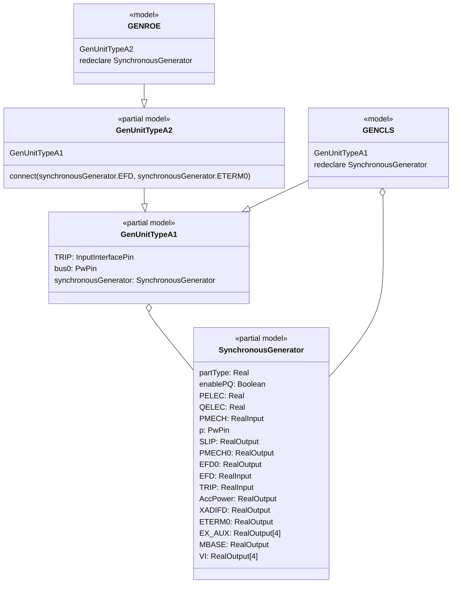
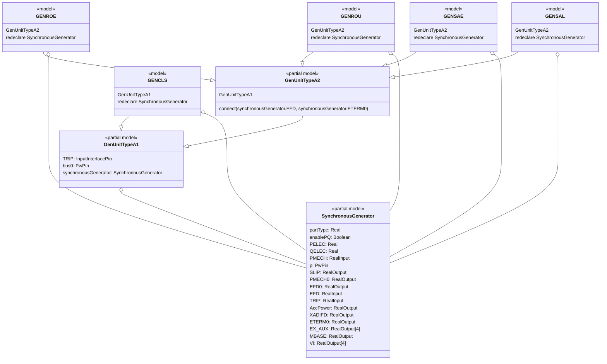
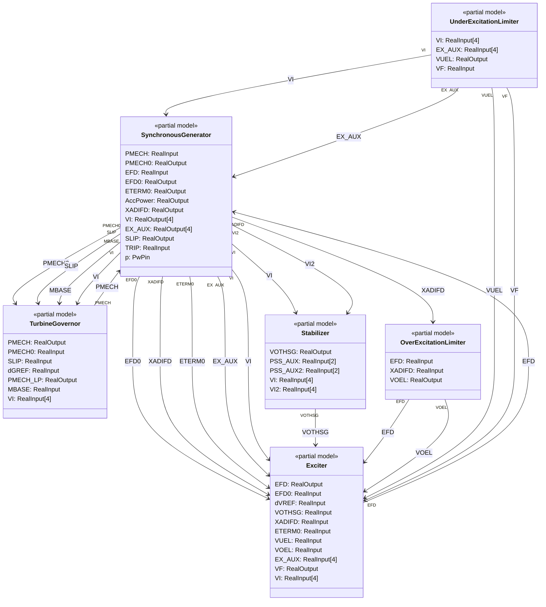

# OpalRT.ModelSets.TypeA — Documentation

## **1. High-Level Structure**

### **TypeA Package**

*   Contains **partial models**: `GenUnitTypeA1` and `GenUnitTypeA2`.
*   Contains **concrete models**: `GENCLS`, `GENROE`, `GENROU`, `GENSAE`, `GENSAL`, each extending either `GenUnitTypeA1` or `GenUnitTypeA2`.
*   Each unit model uses:
    *   A **replaceable synchronous generator** (from `Electrical.PartialModel.SynchronousGenerator` or its redeclared versions).

### **Partial Models**

*   **GenUnitTypeA1**: Base for units with a synchronous machine only.
*   **GenUnitTypeA2**: Extends `GenUnitTypeA1`, adds more connections (e.g., excitation system).

### **Electrical.PartialModel**

*   **SynchronousGenerator**: Partial model for synchronous generator behavior.
*   Other partial models: Exciter, TurbineGovernor, Stabilizer, etc.

***

## **2. Object-Oriented Connections**

*   **Inheritance**: Concrete models inherit from partial models (`GenUnitTypeA1` or `GenUnitTypeA2`).
*   **Composition**: Each unit contains a synchronous generator.
*   **Replaceable Classes**: Synchronous generator is replaceable, allowing for flexible configuration.

***

## **3. Class Diagrams**

Below is a Mermaid diagram that captures the main relationships and structure.

Here’s a detailed Mermaid class diagram that includes all machine types from the EPFMU Modelica library, showing how each concrete generator model (GENCLS, GENROE, GENROU, GENSAE, GENSAL) is structured and connected to partial models.

Here’s a detailed Mermaid class diagram showing how the **electrical components**—such as the Exciter, TurbineGovernor, Stabilizer, OverExcitationLimiter, and UnderExcitationLimiter—connect to the **SynchronousGenerator** in your Modelica library.

***

## **4. Summary of Connections**

*   **GenUnitTypeA1** is the base partial model for generator units, containing the main electrical components.
*   **GenUnitTypeA2** extends `GenUnitTypeA1`, adding further connections (e.g., excitation).
*   **Concrete models** (`GENCLS`, `GENROE`, etc.) extend these partial models and redeclare the generator for specific machine types.
*   **SynchronousGenerator** is the core electrical model, with connections to other components (Exciter, TurbineGovernor, etc.) as needed.

***
