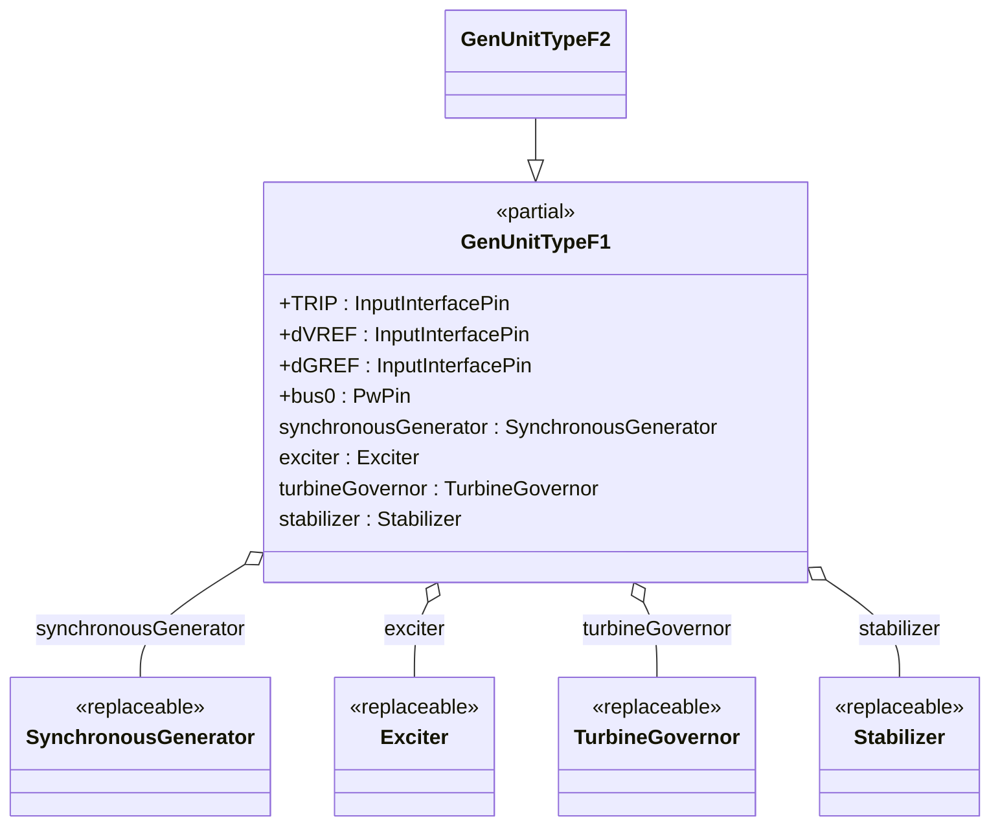
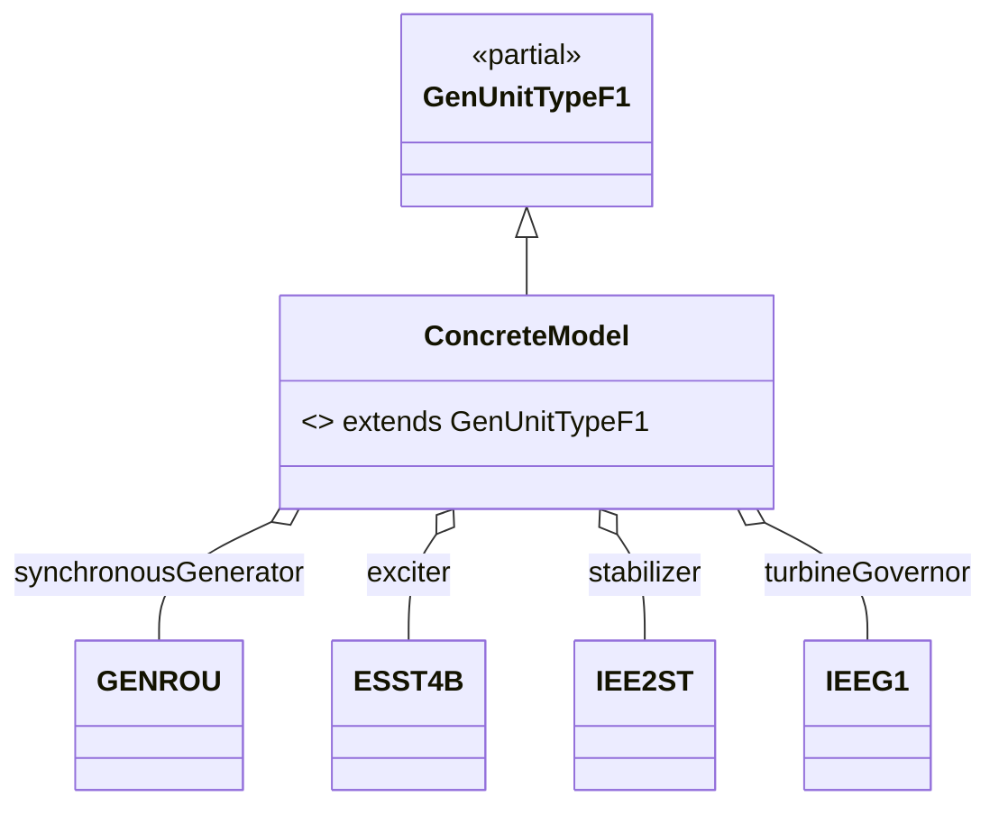

# OpalRT.ModelSets.TypeF — Documentation

## **1. High-Level Structure**

### **TypeF Package Overview**

The **TypeF** package defines the most comprehensive generator unit models in the OpalRT.ModelSets library. These models combine a **Synchronous Machine**, an **Excitation System**, a **Turbine-Governor**, and a **Power System Stabilizer (PSS)**. TypeF models are designed for advanced dynamic studies where all major generator control loops and their interactions are relevant, such as grid integration, disturbance response, and control coordination.

*   **Partial Models:**
    *   `GenUnitTypeF1`: Standard interface for all four subsystems.
    *   `GenUnitTypeF2`: Variant with additional trip logic input (`vTRIP`) for advanced protection or testing scenarios.
*   **Purpose:** Provide a flexible, extensible template for generator units with all major control systems.
*   **Key Features:** Highly modular, object-oriented, and fully parameterized via replaceable components.

***

## **2. Object-Oriented Features**

### **Inheritance and Composition**

*   **Inheritance:**\
    Concrete models extend `GenUnitTypeF1` or `GenUnitTypeF2`.
*   **Composition:**\
    Each unit contains:
    *   A **replaceable synchronous generator** (e.g., `GENROU`, `GENSAE`, `GENSAL`)
    *   A **replaceable exciter** (e.g., `ESST4B`, `EXAC1A`, `AC7B`)
    *   A **replaceable turbine-governor** (e.g., `IEEEG1`, `GGOV1`, `GAST`)
    *   A **replaceable stabilizer** (e.g., `IEE2ST`, `PSS2A`, `IEEEST`)

### **Replaceable Architecture**

*   All major components are declared as `replaceable`, enabling flexible instantiation and substitution in derived models.

***

## **3. Class Diagrams**

### **High-Level Class Diagram**



*GenUnitTypeF2 adds a `vTRIP` input for advanced trip/protection logic.*

***

### **Component Extension Map (TypeF)**



***

## **4. Signal Connections**

TypeF models define all major signal connections between generator, exciter, governor, and stabilizer, including:

*   **TRIP** → synchronousGenerator.TRIP
*   **dVREF** → exciter.dVREF
*   **dGREF** → turbineGovernor.dGREF
*   **bus0** ← synchronousGenerator.p
*   **synchronousGenerator** ↔ exciter (EFD, EFD0, ETERM0, EX\_AUX, VI, XADIFD)
*   **synchronousGenerator** ↔ turbineGovernor (PMECH, PMECH0, SLIP, MBASE, VI)
*   **synchronousGenerator** ↔ stabilizer (VI, SLIP, AccPower)
*   **stabilizer** → exciter (VOTHSG)
*   **stabilizer**: internal connections (PSS\_AUX, PSS\_AUX2, VI2)

***

## **5. Example: Implementation of a TypeF Model**

Here is a concrete example based on your provided file [GENROU\_ESST4B\_IEE2ST\_IEEEG1\_new.txt](https://opalrttechnologies104-my.sharepoint.com/personal/miguel_aguilera_opal-rt_com/Documents/Microsoft%20Copilot%20Chat%20Files/GENROU_ESST4B_IEE2ST_IEEEG1_new.txt?EntityRepresentationId=6b05ebd7-a756-43df-8501-dee3daadc55c): [\[GENROU\_ESS...IEEEG1\_new | Txt\]](https://opalrttechnologies104-my.sharepoint.com/personal/miguel_aguilera_opal-rt_com/Documents/Microsoft%20Copilot%20Chat%20Files/GENROU_ESST4B_IEE2ST_IEEEG1_new.txt)

```modelica
model GENROU_ESST4B_IEE2ST_IEEEG1
  extends OpalRT.ModelSets.TypeF.GenUnitTypeF1(
    redeclare Electrical.Machine.SynchronousMachine.GENROU synchronousGenerator(
      IBUS = IBUS,
      ID = M_ID,
      P_gen = P_gen,
      Q_gen = Q_gen,
      Vt_abs = Vt_abs,
      Vt_ang = Vt_ang,
      SB = SB,
      fn = fn,
      ZSOURCE_RE = ZSOURCE_RE,
      Tdo_p = Tdo_p,
      Tdo_s = Tdo_s,
      Tqo_p = Tqo_p,
      Tqo_s = Tqo_s,
      H = H,
      D = D,
      Xd = Xd,
      Xq = Xq,
      Xd_p = Xd_p,
      Xq_p = Xq_p,
      Xd_s = Xd_s,
      Xl = Xl,
      S1 = S1,
      S12 = S12
    ),
    redeclare Electrical.Control.Excitation.ESST4B exciter(
      TR = TR_ex,
      KPR = KPR_ex,
      KIR = KIR_ex,
      VRMAX = VRMAX_ex,
      VRMIN = VRMIN_ex,
      TA = TA_ex,
      KPM = KPM_ex,
      KIM = KIM_ex,
      VMMAX = VMMAX_ex,
      VMMIN = VMMIN_ex,
      KG = KG_ex,
      KP = KP_ex,
      KI = KI_ex,
      VBMAX = VBMAX_ex,
      KC = KC_ex,
      XL = XL_ex,
      THETAP = THETAP_ex
    ),
    redeclare Electrical.Control.Stabilizer.IEE2ST stabilizer(
      K1 = K1_pss,
      K2 = K2_pss,
      T1 = T1_pss,
      T2 = T2_pss,
      T3 = T3_pss,
      T4 = T4_pss,
      T5 = T5_pss,
      T6 = T6_pss,
      T7 = T7_pss,
      T8 = T8_pss,
      T9 = T9_pss,
      T10 = T10_pss,
      LSMAX = LSMAX_pss,
      LSMIN = LSMIN_pss,
      VCU = VCU_pss,
      VCL = VCL_pss,
      M0 = M0_pss,
      M1 = M1_pss,
      M2 = M2_pss,
      M3 = M3_pss
    ),
    redeclare Electrical.Control.TurbineGovernor.IEEEG1 turbineGovernor(
      ID = M_ID,
      K = K_tg,
      T1 = T1_tg,
      T2 = T2_tg,
      T3 = T3_tg,
      Uo = Uo_tg,
      Uc = Uc_tg,
      PMAX = PMAX_tg,
      PMIN = PMIN_tg,
      T4 = T4_tg,
      K1 = K1_tg,
      K2 = K2_tg,
      T5 = T5_tg,
      K3 = K3_tg,
      K4 = K4_tg,
      T6 = T6_tg,
      K5 = K5_tg,
      K6 = K6_tg,
      T7 = T7_tg,
      K7 = K7_tg,
      K8 = K8_tg
    ),
    const1(k = noVOEL)
  );
end GENROU_ESST4B_IEE2ST_IEEEG1;
```

*   **All parameters** ensure full configurability and reproducibility.
*   **All four control systems** are present and can be swapped or tuned independently.

***

## **6. Key Points**

*   **TypeF models** are the most complete and flexible generator unit templates in the library, supporting all major control loops.
*   **All parameters** are fully configurable, making the models easy to configure for different scenarios and studies.
*   **Signal connections** are clearly defined, supporting advanced dynamic simulations, control interaction studies, and grid integration analysis.
*   **Extensibility:**
    *   Swap any subsystem (machine, exciter, governor, stabilizer) by redeclaring the component.
    *   Use `GenUnitTypeF2` for advanced trip/protection logic with the `vTRIP` input.

***

## **7. Summary Table: TypeF Model Structure**

| Component        | Description / Example (from GENROU\_ESST4B\_IEE2ST\_IEEEG1) |
| ---------------- | ----------------------------------------------------------- |
| Synchronous Gen. | `GENROU` (redeclared)                                       |
| Exciter          | `ESST4B` (redeclared)                                       |
| Turbine-Governor | `IEEEG1` (redeclared)                                       |
| Stabilizer (PSS) | `IEE2ST` (redeclared)                                       |

