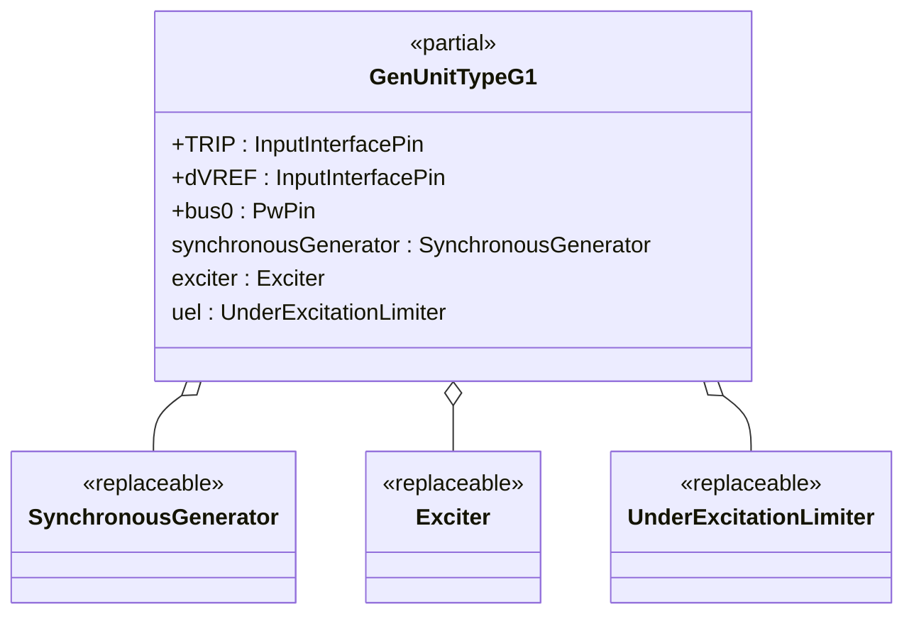
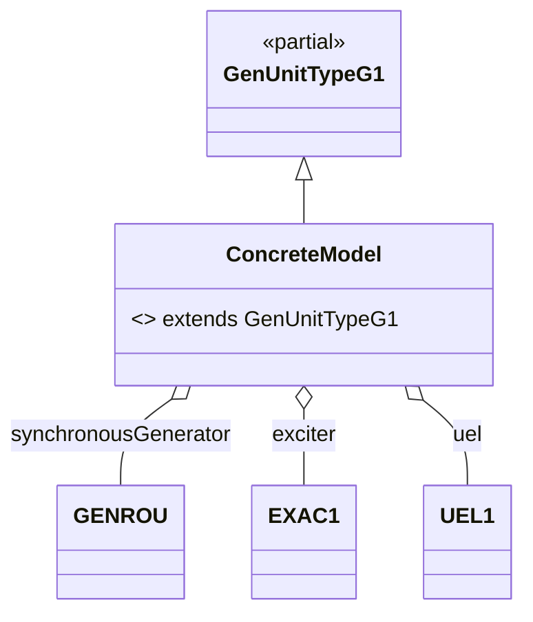

# OpalRT.ModelSets.TypeG — Documentation

## **1. High-Level Structure**

### **TypeG Package Overview**

The **TypeG** package defines generator unit models that combine a **Synchronous Machine**, an **Excitation System**, and an **Under-Excitation Limiter (UEL)**. TypeG models are designed for dynamic studies where generator excitation and UEL protection are relevant, but turbine-governor and stabilizer loops are not present. These models are ideal for scenarios such as excitation system validation, UEL coordination, and studies where mechanical control is handled externally or is not required.

*   **Partial Models:**
    *   `GenUnitTypeG1`: Standard interface for synchronous machine, exciter, and UEL.
*   **Purpose:** Provide a modular, extensible template for generator units with excitation and UEL protection.
*   **Key Features:** Highly modular, object-oriented, and fully parameterized via replaceable components.

***

## **2. Object-Oriented Features**

### **Inheritance and Composition**

*   **Inheritance:**\
    Concrete models extend `GenUnitTypeG1`.
*   **Composition:**\
    Each unit contains:
    *   A **replaceable synchronous generator** (e.g., `GENROU`, `GENSAE`, `GENSAL`)
    *   A **replaceable exciter** (e.g., `EXAC1`, `EXAC4`, `ESST1A`, `EXPIC1`, `IEEEX1`, `ESDC2A`)
    *   A **replaceable UEL** (`UEL1` or `UEL2`)


### **Replaceable Architecture**

*   All major components are declared as `replaceable`, enabling flexible instantiation and substitution in derived models.

***

## **3. Class Diagrams**

### **High-Level Class Diagram**



***

### **Component Extension Map (TypeG)**



***

## **4. Signal Connections**

TypeG models define all major signal connections between generator, exciter, and UEL, including:

*   **TRIP** → synchronousGenerator.TRIP
*   **dVREF** → exciter.dVREF
*   **bus0** ← synchronousGenerator.p
*   **synchronousGenerator ↔ exciter** (EFD, EFD0, ETERM0, EX\_AUX, VI, XADIFD)
*   **synchronousGenerator ↔ UEL** (VI, EX\_AUX)
*   **UEL → exciter** (VUEL, VF)
*   **Default PMECH0 → PMECH** short (no governor present)
*   **VOEL/VOTHSG** are set to constants (no OEL or stabilizer present)

***

## **5. Example: Implementation of a TypeG Model**

Here is a concrete example based on the migrated model `GENROU_EXAC1_UEL2`:

```modelica
model GENROU_EXAC1_UEL2
  extends GenUnitTypeG1(
    redeclare Electrical.Machine.SynchronousMachine.GENROU synchronousGenerator(
      ID = M_ID,
      P_gen = P_gen,
      Q_gen = Q_gen,
      Vt_abs = Vt_abs,
      Vt_ang = Vt_ang,
      SB = SB,
      fn = fn,
      ZSOURCE_RE = ZSOURCE_RE,
      Tdo_p = Tdo_p,
      Tdo_s = Tdo_s,
      Tqo_p = Tqo_p,
      Tqo_s = Tqo_s,
      H = H,
      D = D,
      Xd = Xd,
      Xq = Xq,
      Xd_p = Xd_p,
      Xq_p = Xq_p,
      Xd_s = Xd_s,
      Xl = Xl,
      S1 = S1,
      S12 = S12
    ),
    redeclare Electrical.Control.Excitation.EXAC1 exciter(
      ID = M_ID,
      TR = TR_ex,
      TB = TB_ex,
      TC = TC_ex,
      KA = KA_ex,
      TA = TA_ex,
      VRMAX = VRMAX_ex,
      VRMIN = VRMIN_ex,
      TE = TE_ex,
      KF = KF_ex,
      TF = TF_ex,
      KC = KC_ex,
      KD = KD_ex,
      KE = KE_ex,
      E1 = E1_ex,
      SE_E1 = SE_E1_ex,
      E2 = E2_ex,
      SE_E2 = SE_E2_ex
    ),
    redeclare Electrical.Control.UnderExcitationLimiter.UEL2 uel(
      TUV = TUV_uel,
      TUP = TUP_uel,
      TUQ = TUQ_uel,
      KUI = KUI_uel,
      KUL = KUL_uel,
      VUIMAX = VUIMAX_uel,
      VUIMIN = VUIMIN_uel,
      KUF = KUF_uel,
      KFB = KFB_uel,
      TUL = TUL_uel,
      TU1 = TU1_uel,
      TU2 = TU2_uel,
      TU3 = TU3_uel,
      TU4 = TU4_uel,
      P0 = P0_uel,
      Q0 = Q0_uel,
      P1 = P1_uel,
      Q1 = Q1_uel,
      P2 = P2_uel,
      Q2 = Q2_uel,
      P3 = P3_uel,
      Q3 = Q3_uel,
      P4 = P4_uel,
      Q4 = Q4_uel,
      P5 = P5_uel,
      Q5 = Q5_uel,
      P6 = P6_uel,
      Q6 = Q6_uel,
      P7 = P7_uel,
      Q7 = Q7_uel,
      P8 = P8_uel,
      Q8 = Q8_uel,
      P9 = P9_uel,
      Q9 = Q9_uel,
      P10 = P10_uel,
      Q10 = Q10_uel,
      VULMAX = VULMAX_uel,
      VULMIN = VULMIN_uel,
      M0 = M0_uel,
      M1 = M1_uel,
      M2 = M2_uel
    )
  );

  parameter Real partType = 1;
end GENROU_EXAC1_UEL2
```

*   **All parameters** ensure full configurability and reproducibility.
*   **All three subsystems** (machine, exciter, UEL) are present and can be swapped or tuned independently.

***

## **6. Key Points**

*   **TypeG models** are modular generator unit templates supporting excitation and UEL protection, but **do not include turbine-governor or stabilizer loops**.
*   **All parameters** are fully configurable, making the models easy to configure for different scenarios and studies.
*   **Signal connections** are clearly defined, supporting dynamic simulations, excitation system studies, and UEL coordination.
*   **Extensibility:**
    *   Swap any subsystem (machine, exciter, UEL) by redeclaring the component.

***

## **7. Summary Table: TypeG Model Structure**

| Component        | Description / Example (from GENROU\_EXAC1\_UEL2) |
| ---------------- | ------------------------------------------------ |
| Synchronous Gen. | `GENROU` (redeclared)                            |
| Exciter          | `EXAC1` (redeclared)                             |
| UEL              | `UEL2` (redeclared)                              |

***

**TypeG models** provide a robust, extensible foundation for generator units with excitation and UEL protection, fully parameterized and ready for advanced studies or integration into larger system models.\
If you need example documentation for a specific concrete TypeG model, or want a variant with additional trip logic (TypeG2), let me know!
