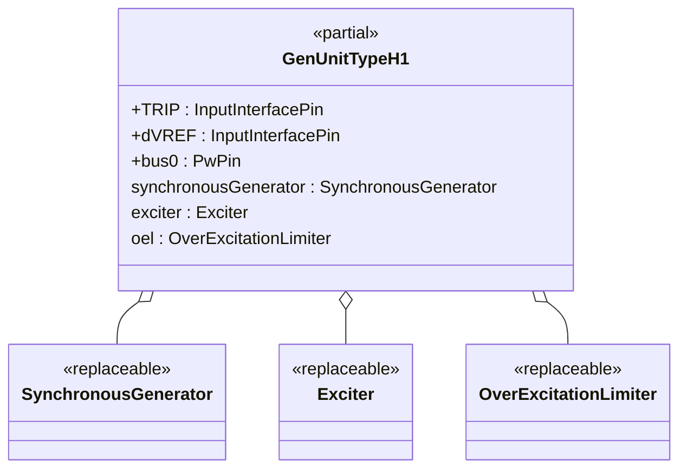
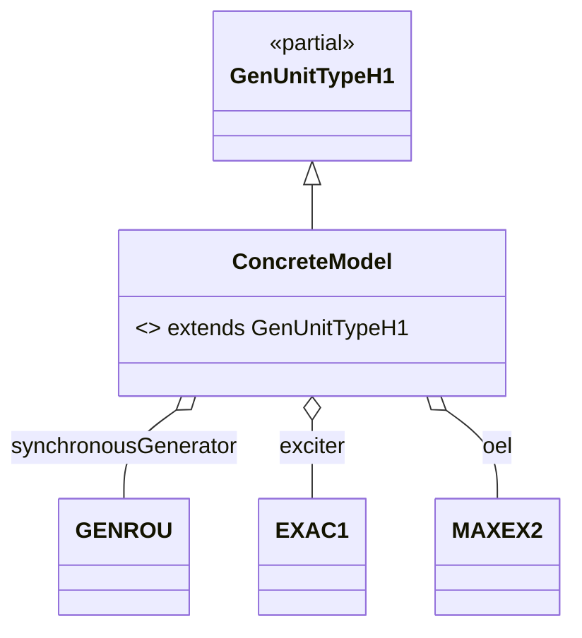

## OpalRT.ModelSets.TypeH — Documentation

### 1. High-Level Structure

#### TypeH Package Overview

The **TypeH** package defines generator unit models that combine a **Synchronous Machine**, an **Excitation System**, and an **Over-Excitation Limiter (OEL)**. These models are designed for dynamic studies where excitation and OEL protection are relevant, but turbine-governor, stabilizer, and UEL loops are not present. TypeH is ideal for OEL validation, excitation system studies, and scenarios where mechanical and UEL control are handled externally.

*   **Partial Model:**
    *   `GenUnitTypeH1`: Standard interface for synchronous machine, exciter, and OEL.
*   **Purpose:**
    *   Provide a modular, extensible template for generator units with excitation and OEL protection.
*   **Key Features:**
    *   Highly modular, object-oriented, and fully parameterized via replaceable components.

***

### 2. Object-Oriented Features

#### Inheritance and Composition

*   **Inheritance:**
    *   Concrete models extend `GenUnitTypeH1`.
*   **Composition:**
    *   Each unit contains:
        *   A **replaceable synchronous generator** (e.g., `GENROU`, `GENSAL`)
        *   A **replaceable exciter** (e.g., `EXAC1`, `ESAC5A`)
        *   A **replaceable OEL** (`MAXEX1`, `MAXEX2`)

#### Replaceable Architecture

*   All major components are declared as `replaceable`, enabling flexible instantiation and substitution in derived models.

***

### 3. Class Diagrams

#### High-Level Class Diagram



#### Component Extension Map (TypeH)



***

### 4. Signal Connections

TypeH models define all major signal connections between generator, exciter, and OEL, including:

*   **TRIP** → synchronousGenerator.TRIP
*   **dVREF** → exciter.dVREF
*   **bus0** ← synchronousGenerator.p
*   **synchronousGenerator ↔ exciter** (EFD, EFD0, ETERM0, EX\_AUX, VI, XADIFD)
*   **synchronousGenerator ↔ OEL** (XADIFD)
*   **OEL → exciter** (VOEL, EFD)
*   **Default PMECH0 → PMECH** short (no governor present)
*   **VOEL/VOTHSG** are set to constants (no UEL or stabilizer present)

***

### 5. Example: Implementation of a TypeH Model

```modelica
model GENROU_EXAC1_MAXEX2
  extends GenUnitTypeH1(
    redeclare Electrical.Machine.SynchronousMachine.GENROU synchronousGenerator(...),
    redeclare Electrical.Control.Excitation.EXAC1 exciter(...),
    redeclare Electrical.Control.OverExcitationLimiter.MAXEX2 oel(...)
  );
end GENROU_EXAC1_MAXEX2
```

*All parameters ensure full configurability and reproducibility.*

***

### 6. Key Points

*   **TypeH models** are modular generator unit templates supporting excitation and OEL protection, but do **not include turbine-governor, UEL, or stabilizer loops**.
*   **All parameters** are fully configurable.
*   **Signal connections** are clearly defined, supporting dynamic simulations and OEL coordination.
*   **Extensibility:**
    *   Swap any subsystem (machine, exciter, OEL) by redeclaring the component.

***

### 7. Summary Table: TypeH Model Structure

| Component        | Description / Example (from GENROU\_EXAC1\_MAXEX2) |
| ---------------- | -------------------------------------------------- |
| Synchronous Gen. | `GENROU` (redeclared)                              |
| Exciter          | `EXAC1` (redeclared)                               |
| OEL              | `MAXEX2` (redeclared)                              |
