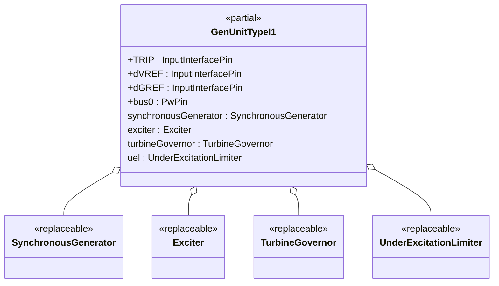
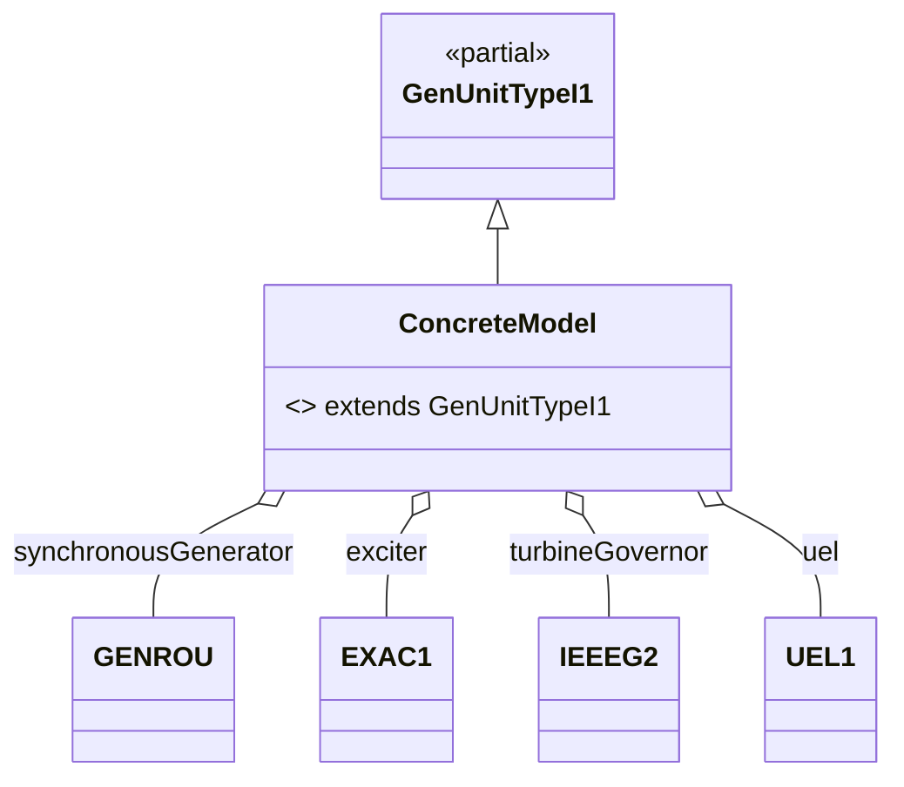

## OpalRT.ModelSets.TypeI — Documentation

### 1. High-Level Structure

#### TypeI Package Overview

The **TypeI** package defines generator unit models that combine a **Synchronous Machine**, an **Excitation System**, a **Turbine-Governor**, and an **Under-Excitation Limiter (UEL)**. These models are designed for dynamic studies where excitation, mechanical control, and UEL protection are all relevant. TypeI is ideal for scenarios requiring both governor and UEL coordination.

*   **Partial Model:**
    *   `GenUnitTypeI1`: Standard interface for synchronous machine, exciter, governor, and UEL.
*   **Purpose:**
    *   Provide a modular, extensible template for generator units with excitation, governor, and UEL protection.
*   **Key Features:**
    *   Highly modular, object-oriented, and fully parameterized via replaceable components.

***

### 2. Object-Oriented Features

#### Inheritance and Composition

*   **Inheritance:**
    *   Concrete models extend `GenUnitTypeI1`.
*   **Composition:**
    *   Each unit contains:
        *   A **replaceable synchronous generator**
        *   A **replaceable exciter**
        *   A **replaceable turbine-governor**
        *   A **replaceable UEL**

#### Replaceable Architecture

*   All major components are declared as `replaceable`.

***

### 3. Class Diagrams

#### High-Level Class Diagram



#### Component Extension Map (TypeI)



***

### 4. Signal Connections

TypeI models define all major signal connections between generator, exciter, governor, and UEL, including:

*   **TRIP** → synchronousGenerator.TRIP
*   **dVREF** → exciter.dVREF
*   **dGREF** → turbineGovernor.dGREF
*   **bus0** ← synchronousGenerator.p
*   **synchronousGenerator ↔ exciter** (EFD, EFD0, ETERM0, EX\_AUX, VI, XADIFD)
*   **synchronousGenerator ↔ turbineGovernor** (PMECH, PMECH0, SLIP, MBASE, VI)
*   **synchronousGenerator ↔ UEL** (VI, EX\_AUX)
*   **UEL → exciter** (VUEL, VF)
*   **Default VOEL/VOTHSG** are set to constants (no OEL or stabilizer present)

***

### 5. Example: Implementation of a TypeI Model

```modelica
model GENROU_EXAC1_IEEEG2_UEL1
  extends GenUnitTypeI1(
    redeclare Electrical.Machine.SynchronousMachine.GENROU synchronousGenerator(...),
    redeclare Electrical.Control.Excitation.EXAC1 exciter(...),
    redeclare Electrical.Control.TurbineGovernor.IEEEG2 turbineGovernor(...),
    redeclare Electrical.Control.UnderExcitationLimiter.UEL1 uel(...)
  );
end GENROU_EXAC1_IEEEG2_UEL1
```

*All parameters are fully configurable.*

***

### 6. Key Points

*   **TypeI models** are modular generator unit templates supporting excitation, governor, and UEL protection.
*   **All parameters** are fully configurable.
*   **Signal connections** are clearly defined, supporting dynamic simulations and UEL/governor coordination.
*   **Extensibility:**
    *   Swap any subsystem (machine, exciter, governor, UEL) by redeclaring the component.

***

### 7. Summary Table: TypeI Model Structure

| Component        | Description / Example (from GENROU\_EXAC1\_IEEEG2\_UEL1) |
| ---------------- | -------------------------------------------------------- |
| Synchronous Gen. | `GENROU` (redeclared)                                    |
| Exciter          | `EXAC1` (redeclared)                                     |
| Turbine-Governor | `IEEEG2` (redeclared)                                    |
| UEL              | `UEL1` (redeclared)                                      |