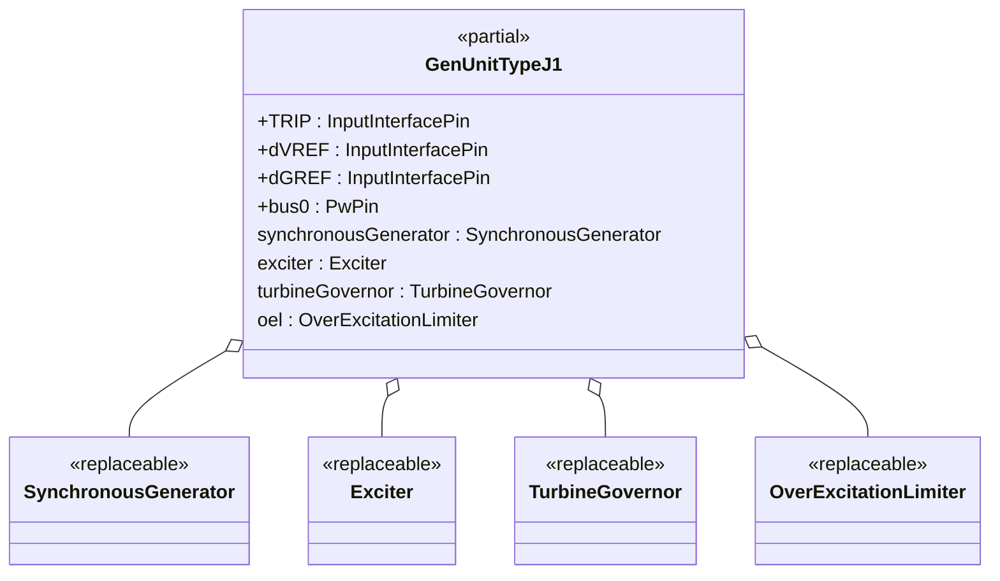
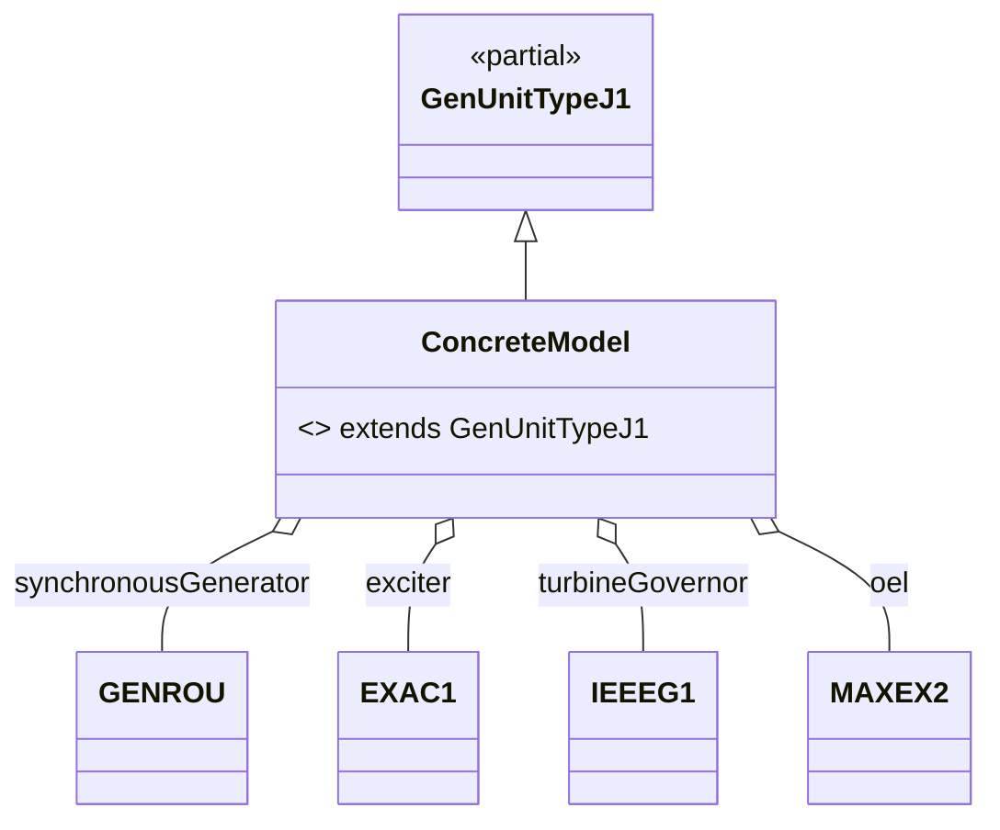

## OpalRT.ModelSets.TypeJ — Documentation

### 1. High-Level Structure

#### TypeJ Package Overview

The **TypeJ** package defines generator unit models that combine a **Synchronous Machine**, an **Excitation System**, a **Turbine-Governor**, and an **Over-Excitation Limiter (OEL)**. These models are designed for dynamic studies where excitation, mechanical control, and OEL protection are all relevant.

*   **Partial Model:**
    *   `GenUnitTypeJ1`: Standard interface for synchronous machine, exciter, governor, and OEL.
*   **Purpose:**
    *   Provide a modular, extensible template for generator units with excitation, governor, and OEL protection.
*   **Key Features:**
    *   Highly modular, object-oriented, and fully parameterized via replaceable components.

***

### 2. Object-Oriented Features

#### Inheritance and Composition

*   **Inheritance:**
    *   Concrete models extend `GenUnitTypeJ1`.
*   **Composition:**
    *   Each unit contains:
        *   A **replaceable synchronous generator**
        *   A **replaceable exciter**
        *   A **replaceable turbine-governor**
        *   A **replaceable OEL**

#### Replaceable Architecture

*   All major components are declared as `replaceable`.

***

### 3. Class Diagrams

#### High-Level Class Diagram



#### Component Extension Map (TypeJ)



***

### 4. Signal Connections

TypeJ models define all major signal connections between generator, exciter, governor, and OEL, including:

*   **TRIP** → synchronousGenerator.TRIP
*   **dVREF** → exciter.dVREF
*   **dGREF** → turbineGovernor.dGREF
*   **bus0** ← synchronousGenerator.p
*   **synchronousGenerator ↔ exciter** (EFD, EFD0, ETERM0, EX\_AUX, VI, XADIFD)
*   **synchronousGenerator ↔ turbineGovernor** (PMECH, PMECH0, SLIP, MBASE, VI)
*   **synchronousGenerator ↔ OEL** (XADIFD)
*   **OEL → exciter** (VOEL, EFD)
*   **Default UEL/VOTHSG** are set to constants (no UEL or stabilizer present)

***

### 5. Example: Implementation of a TypeJ Model

```modelica
model GENROU_EXAC1_IEEEG1_MAXEX2
  extends GenUnitTypeJ1(
    redeclare Electrical.Machine.SynchronousMachine.GENROU synchronousGenerator(...),
    redeclare Electrical.Control.Excitation.EXAC1 exciter(...),
    redeclare Electrical.Control.TurbineGovernor.IEEEG1 turbineGovernor(...),
    redeclare Electrical.Control.OverExcitationLimiter.MAXEX2 oel(...)
  );
end GENROU_EXAC1_IEEEG1_MAXEX2
```

*All parameters ensure full configurability and reproducibility.*

***

### 6. Key Points

*   **TypeJ models** are modular generator unit templates supporting excitation, governor, and OEL protection.
*   **All parameters** are fully configurable, making the models easy to configure for different scenarios and studies.
*   **Signal connections** are clearly defined, supporting dynamic simulations and OEL/governor coordination.
*   **Extensibility:**
    *   Swap any subsystem (machine, exciter, governor, OEL) by redeclaring the component.

***

### 7. Summary Table: TypeJ Model Structure

| Component        | Description / Example (from GENROU\_EXAC1\_IEEEG1\_MAXEX2) |
| ---------------- | ---------------------------------------------------------- |
| Synchronous Gen. | `GENROU` (redeclared)                                      |
| Exciter          | `EXAC1` (redeclared)                                       |
| Turbine-Governor | `IEEEG1` (redeclared)                                      |
| OEL              | `MAXEX2` (redeclared)                                      |
