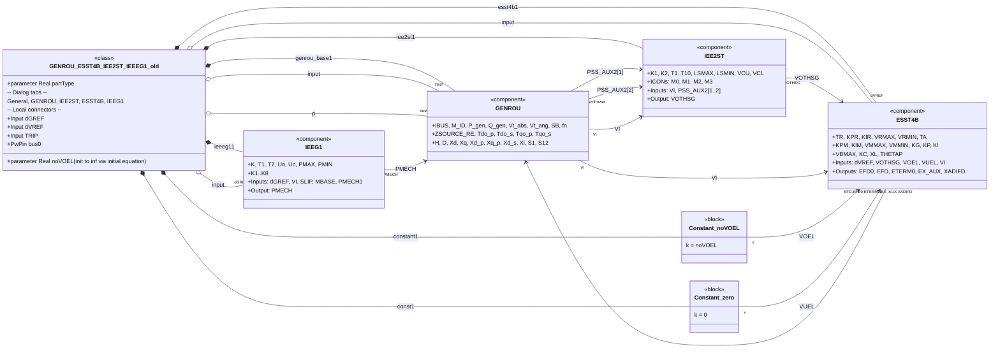
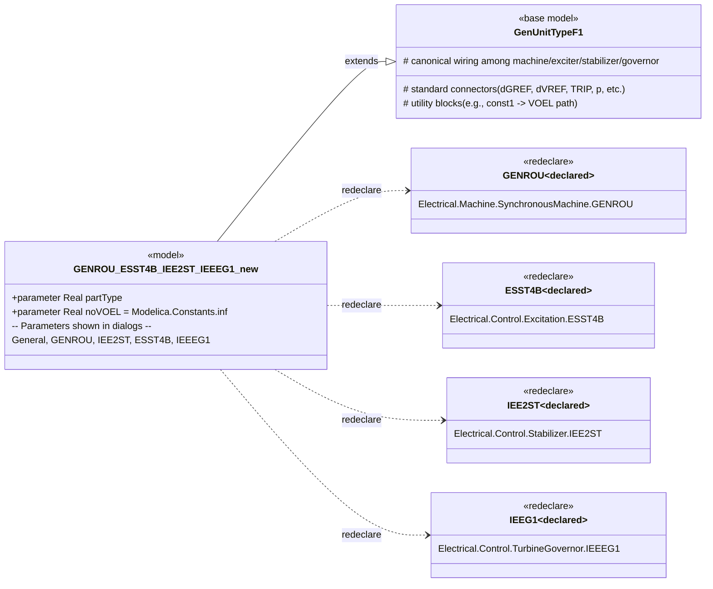

# Migration from EPFMU to ePHASORSIM Modelica Library 1.0.0

This document describes the architectural changes introduced in the migration from the legacy EPFMU library to the ePHASORSIM Modelica Library 1.0.0. To illustrate the changes, we compare the `GENROU_ESST4B_IEE2ST_IEEEG1` Generating Unit (GenUnit) model, before and after the migration.

1.  **Architecture refactor — from monolithic to template-based**  
    The new model is now a `model` that **extends `GenUnitTypeF1`** and **redeclares** its subcomponents (GENROU, ESST4B, IEE2ST, IEEG1). The old version was a self-contained `class` that instantiated and wired every component locally. This removes 100% of explicit `connect()` code from the concrete model (old: **23 connections**, new: **0**), shifting wiring into the shared base class.

2.  **Parameters externalized**  
    Instead of hardcoded numeric defaults in the model, the new version **uses configurable parameters** declared directly inside each redeclared component. This separates *topology/equations* from *parameter values* and standardizes dialogs across units.

3.  **Behavioral surface preserved, UI made consistent**  
    The same domains and counts of parameters are being kept (both versions define **84** parameters and the same tab grouping for *General / GENROU / IEE2ST / ESST4B / IEEEG1*), so the user-facing configuration surface stays familiar.

4.  **Limiter handling simplified**  
    The old version computed `noVOEL = Modelica.Constants.inf` via an `initial equation` and fed a `Constant` block; the new version directly declares `noVOEL = Modelica.Constants.inf` and assigns it via `const1(k = noVOEL)` inside the `extends (…)` list—cleaner and easier to audit.

***

## Detailed change log

### A. Declaration & structure

*   **Old**:
    ```modelica
    class GENROU_ESST4B_IEE2ST_IEEEG1
      // local instances + connectors + connect()...
    end GENROU_ESST4B_IEE2ST_IEEEG1;
    ```
    (Explicit instances of machine, exciter, stabilizer, governor; declares pins `dGREF`, `dVREF`, `TRIP`, `bus0`; large `equation` section with connects.)

*   **New**:
    ```modelica
    model GENROU_ESST4B_IEE2ST_IEEEG1
      extends GenUnitTypeF1(
        redeclare Electrical.Machine.SynchronousMachine.GENROU synchronousGenerator(...),
        redeclare Electrical.Control.Excitation.ESST4B exciter(...),
        redeclare Electrical.Control.Stabilizer.IEE2ST stabilizer(...),
        redeclare Electrical.Control.TurbineGovernor.IEEEG1 turbineGovernor(...),
        const1(k = noVOEL));
    end GENROU_ESST4B_IEE2ST_IEEEG1;
    ```
    (No local connectors or `connect()` statements; wiring is inherited from `GenUnitTypeF1`.)

**Advantages**: Canonical wiring across Type-F units, fewer hand-connections to maintain, lower risk of mismatched pins after edits, and quicker reviews.

***

### B. Parameterization & dialogs

*   **Old**: parameters had **numeric defaults** directly in the model (e.g., `IBUS=100`, `P_gen=1000`, various ESST4B/IEE2ST/IEEG1 values). The same parameter appears across tabs but the values live in the model code.

*   **New**: each parameter is **configurable** (e.g., `IBUS`, `Xd`, `K1_pss`, `PMAX_tg`). The dialog tabs remain: *General*, *GENROU Parameters*, *IEE2ST Parameters*, *ESST4B Parameters*, *IEEEG1*.

**Advantages**:

*   **Separation of concerns**—equations in the model, parameter values in component declarations.
*   **Repeatability & governance**—component configurations can be versioned and swapped by changing only a `redeclare`.
*   **Consistency**—the same component configuration can drive several unit models with identical UI tabs and field names.

***

### C. Component instances & connections

*   **Old**: local instances `genrou_base1`, `esst4b1`, `iee2st1`, `ieeeg11` plus pins `dGREF`, `dVREF`, `TRIP`, `bus0`. There are **23** explicit `connect()` statements (e.g., feeding `PSS_AUX2[1..2]` from `SLIP` and `AccPower`, VOEL/VUEL connections, machine–governor–exciter couplings).
*   **New**: **no** local connector or `connect()` code; those links are encapsulated in `GenUnitTypeF1`. Parameter passing to each subcomponent happens in the `redeclare (…)` argument lists.

**Advantages**: Eliminates boilerplate, reduces diagram clutter, and encourages uniform interface conventions for downstream assemblies.

***

### D. VOEL/VUEL & constants

*   **Old**:
    *   `parameter Real noVOEL(fixed=false, start=1);` with `initial equation` setting it to `Modelica.Constants.inf`.
    *   `Modelica.Blocks.Sources.Constant constant1(k = noVOEL)` routed to `ESST4B.VOEL`.
    *   A second `const1(k = 0)` used for `VUEL`.
*   **New**:
    *   `parameter Real noVOEL = Modelica.Constants.inf` declared directly.
    *   `const1(k = noVOEL)` is passed via the `extends` call (the base class provides the constant block and wiring).

**Advantages**: Fewer moving parts, more explicit intent, and easier toggling later if you need to activate limiters.

***

### E. Minor clean-ups

*   The old `constant Real pi = Modelica.Constants.pi;` is gone—no unused constants remain.
*   Icon/diagram annotations are simplified to a single title text in the new file; the heavy diagram spec from the old file is not replicated. (Visual clutter reduction; relies on base type visuals.)

***

## Benefits of the update (why this is a net improvement)

1.  **Maintainability & standardization**  
    Moving to **`GenUnitTypeF1` + `redeclare`** unifies how Type-F units are built and wired. Future updates to the shared topology land in one place, reducing regression risk across your library.

2.  **Configurability & reuse**  
    Because parameters are configurable, creating machine or control variants (OEM packages, study cases, testbeds) becomes a matter of swapping component redeclares—no internal edits or re-wiring needed.

3.  **Traceability & reproducibility**  
    Component configurations can be version-controlled and cited in reports, satisfying model governance and facilitating apples-to-apples comparisons between runs.

4.  **Reduced error surface**  
    Eliminating 23 explicit `connect()` statements and local connectors lowers the chance of subtle wiring mistakes (wrong index, wrong polarity, forgotten connect) and simplifies model reviews.

5.  **Cleaner limiter policy**  
    Explicit, centralized handling of `VOEL/VUEL` via the base type clarifies whether limiters are active and how they’re parameterized—useful for certification and audit trails.

***

## Ready-to-paste documentation blurb

> **Model name:** *GENROU\_ESST4B\_IEE2ST\_IEEEG1*  
> **Purpose:** Type-F synchronous generating unit with **GENROU** machine, **ESST4B** exciter, **IEE2ST** stabilizer, and **IEEEG1** turbine governor. The model **extends `GenUnitTypeF1`** and **redeclares** the subcomponents, enabling straightforward swapping of components without modifying the topology. **VOEL** is disabled by setting `noVOEL = Modelica.Constants.inf` and passing `const1(k = noVOEL)` via the base type.

> **What’s new vs. previous implementation:** The earlier implementation instantiated and wired components locally, included numerous `connect()` statements, and embedded numeric defaults in the model. The new version centralizes wiring in the base class, removes local connectors, and centralizes all parameters—improving maintainability, configurability, and reproducibility.

***

## Illustrative diff (key lines)

```diff
- class GENROU_ESST4B_IEE2ST_IEEEG1
-   OpalRT.Electrical.Machine.SynchronousMachine.GENROU genrou_base1(...);
-   OpalRT.Electrical.Control.Excitation.ESST4B         esst4b1(...);
-   OpalRT.Electrical.Control.Stabilizer.IEE2ST         iee2st1(...);
-   OpalRT.Electrical.Control.TurbineGovernor.IEEEG1    ieeeg11(...);
-   input ... dGREF; input ... dVREF; input ... TRIP; PwPin bus0;
-   // 23 explicit connect() statements ...
+ model GENROU_ESST4B_IEE2ST_IEEEG1
+   extends GenUnitTypeF1(
+     redeclare Electrical.Machine.SynchronousMachine.GENROU synchronousGenerator(...),
+     redeclare Electrical.Control.Excitation.ESST4B         exciter(...),
+     redeclare Electrical.Control.Stabilizer.IEE2ST         stabilizer(...),
+     redeclare Electrical.Control.TurbineGovernor.IEEEG1    turbineGovernor(...),
+     const1(k = noVOEL));
```

*(Derived from the two files above; code shortened to highlight structure only.)*

## Class diagrams

## Diagrams

## 1) **Old version** — monolithic class, explicit wiring & local connectors

Key characteristics captured below:

*   Concrete **`class GENROU_ESST4B_IEE2ST_IEEEG1`** directly *contains* the machine, exciter, stabilizer, and governor instances
*   Local **Pins/Inputs** (`dGREF`, `dVREF`, `TRIP`, `PwPin bus0`) live in this class
*   **23** explicit `connect()` statements wire everything internally (represented as associations)



> The diagram abstracts wiring into associations and shows local connectors explicitly, mirroring the old code’s structure.

***

## 2) **New version** — template‑based model using `extends` + `redeclare`

Key characteristics captured below:

*   Concrete **`model GENROU_ESST4B_IEE2ST_IEEEG1`** **extends `GenUnitTypeF1`**
*   Subcomponents are **redeclared**; **wiring and connectors are inherited** from the base type
*   Parameters are **fully configurable** (no numeric defaults inside the model)



> The diagram emphasizes **inheritance** and **redeclare** relationships, that replace hardcoded wiring.

***

